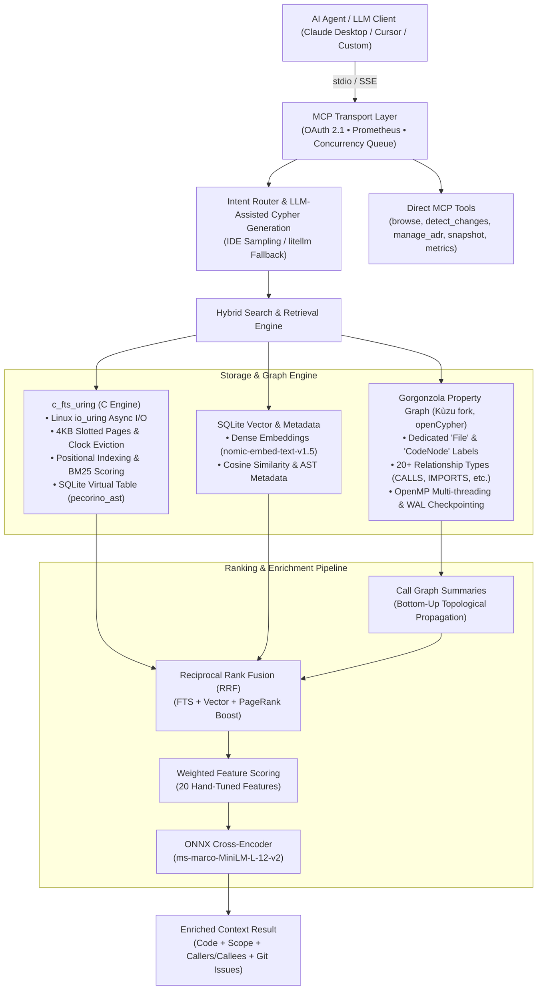

# Pecorino MCP Server

A Model Context Protocol (MCP) server for codebase indexing, search, and analysis — including AST parsing, openCypher property graphs, hybrid keyword + vector search, Git history metrics, and OOP coupling metrics.

Pecorino enables Large Language Models (LLMs) and AI development tools (such as Claude Desktop, Cursor, and custom agentic frameworks) to inspect codebases, traverse call graphs, execute openCypher queries, calculate complexity/maintainability metrics, and triage architectural risks.

---

## Features

- **Model Context Protocol (MCP)**: Exposes 8 unified tools (`browse`, `search`, `update_index`, `detect_changes`, `manage_adr`, `manage_snapshot`, `query_graph`, `metrics`) for AI agents.
- **High-Performance `c_fts_uring` Search Engine**: Custom C-based full-text search engine with `io_uring` asynchronous I/O, custom VFS, 4KB slotted pages, clock buffer pool eviction, crash-safe write-ahead logging (WAL), positional indexing for phrase search, dynamic per-field BM25 scoring, and SQLite virtual table integration (`pecorino_ast`).
- **Hybrid Search (Keyword + Vector)**: Blends relational/FTS metadata with dense vector embeddings (`nomic-embed-text-v1.5`) via SQLite for fast cosine similarity and Reciprocal Rank Fusion (RRF).
- **Gorgonzola Graph Database (a fork of Kùzu)**: Embedded openCypher property graph featuring dedicated `File`, `CodeNode`, and `Identifier` labels, 20+ relationship types, OpenMP multi-threaded parallel graph traversal, GraphAPI abstraction, and automatic WAL checkpointing.
- **LLM-Assisted Cypher Generation**: Generates openCypher queries from natural language using MCP IDE sampling (`ctx.create_message`) with local LLM fallback via `litellm` (e.g., Ollama / Llama 3).
- **Bottom-Up Call Graph Summaries**: Topological sort on call graph edges, then builds text summaries by concatenating function name, docstring, and callee names — enriching symbol representations for downstream retrieval.
- **Weighted Feature Scoring & Cross-Encoder Reranking**: Hand-tuned weighted linear ranker (`ltr_ranker.py`) combining 20 features (PageRank, betweenness centrality, OOP metrics, Git churn), plus local ONNX Cross-Encoder (`ms-marco-MiniLM-L-12-v2`) pairwise candidate reranking.
- **RAM-Disk Staging & Dirty Tracking**: `/dev/shm` tmpfs staging (`ramdisk.py`) to eliminate SSD write amplification during indexing, metadata-based dirty-tracking (`upsert_file_hashes_bulk`), and fine-grained profiling via `IndexProfiler`.
- **Git History Metrics & OOP Coupling Metrics**: Commit frequency, author distribution, code churn, bug-fix ratios, afferent/efferent coupling (Ca/Ce), instability (I), abstractness (A), and Distance-from-Main-Sequence (D).
- **Security & Observability**: OAuth 2.1 authentication flow, role-based tool authorization (Admin access for `metrics`), rate limiting, path traversal validation, and Prometheus telemetry (`TOOL_CALLS`, `TOOL_ERRORS`, `TOOL_DURATION`, `ACTIVE_SESSIONS`, `FTS_SCAN_DURATION`, `GRAPH_DB_SIZE`).

---

## Quick Start

### 1. System Prerequisites
Ensure you have the required build tools installed (needed to compile the native `gorgonzola` and `c_fts_uring` modules):

* **Fedora/RHEL**: `sudo dnf install cmake ninja-build gcc gcc-c++ ccache python3-devel libuv-devel`
* **Ubuntu/Debian**: `sudo apt install cmake ninja-build build-essential ccache python3-dev libuv1-dev`
* **macOS**: `brew install cmake ninja ccache libuv`

### 2. Installation
Clone the repository recursively to pull submodules (`gorgonzola`, `c_fts_uring`, `py-tree-sitter`, `pecorino-utils`, `python-sdk`) and run the setup script:

```bash
# Clone recursively
git clone --recursive https://github.com/pecorino-mcp/pecorino.git
cd pecorino

# Run the environment setup script
# This initializes .venv, installs dependencies, compiles gorgonzola & c_fts_uring, and registers CLI tools
./scripts/setup_env.sh

# Activate the virtual environment
source .venv/bin/activate
```

### 3. Configure Claude Desktop
Add Pecorino to your `claude_desktop_config.json`:

* **macOS:** `~/Library/Application Support/Claude/claude_desktop_config.json`
* **Linux:** `~/.config/Claude/claude_desktop_config.json`
* **Windows:** `%APPDATA%\Claude\claude_desktop_config.json`

```json
{
  "mcpServers": {
    "pecorino": {
      "command": "/path/to/pecorino/.venv/bin/pecorino-mcp",
      "args": ["--transport", "stdio"],
      "env": {
        "PYTHONPATH": "/path/to/pecorino"
      }
    }
  }
}
```
*(Replace `/path/to/pecorino` with your actual repository path).*

---

## Exposed MCP Tools

Pecorino exposes 8 unified MCP tools designed for LLMs and autonomous coding agents:

### 1. `browse`
Inspect codebase structure and retrieve precise source code slices.
- **Parameters**:
  - `target` *(string, optional)*: Absolute path to the target directory or file. Defaults to current workspace root.
  - `view` *(string, default: `"tree"`)*: View mode — `"tree"`, `"classes"`, `"functions"`, `"deps"`, `"all"`, `"pagerank"`, `"summary"`, or `"code"`.
  - `start_line` *(integer, optional)*: Starting line number (1-indexed, inclusive). Required when `view="code"`.
  - `end_line` *(integer, optional)*: Ending line number (1-indexed, inclusive). Required when `view="code"`.
  - `limit` *(integer, default: `10`)*: Maximum results to return.
  - `offset` *(integer, default: `0`)*: Pagination offset.
  - `allow_external` *(boolean, default: `true`)*: Allow traversing paths outside the workspace root.

### 2. `search`
Unified search, call-graph traversal, dependency tracing, and semantic retrieval tool.
- **Parameters**:
  - `query` *(string, optional)*: Search query string, symbol name, or Cypher statement.
  - `target` *(string, optional)*: Scope search to a specific file or directory path.
  - `mode` *(string, default: `"auto"`)*:
    - **`auto`** — Heuristic query classification and automatic routing via `IntentRouter`.
    - **`hybrid`** — Blended vector + keyword search with weighted scoring.
    - **`fts`** — Full-text keyword search powered by `c_fts_uring` with positional indexing.
    - **`callers`** — Call graph analysis: find all functions/methods calling a given symbol.
    - **`callees`** — Call graph analysis: find all functions/methods called by a given symbol.
    - **`impact`** — Deep dependency and blast-radius trace from a file or symbol.
    - **`usages`** — Combined search + caller hierarchy in a single invocation.
    - **`intent`** — Preset AST queries (`all_classes`, `all_functions`, `entry_points`, `dead_code`, `files_by_language`).
    - **`dsl`** — Custom JSON query DSL executed against the AST and graph index.
    - **`functional-analysis`** — Evaluates functional purity and side effects.
    - **`cypher`** — Embedded read-only openCypher query execution.
    - **`community`** — Semantic neighborhood discovery via Leiden graph community detection.
    - **`trace`** — Multi-hop call graph path traversal between symbols.
  - `intent` *(string, optional)*: Intent preset name when `mode="intent"`.
  - `query_json` *(string, optional)*: JSON DSL payload when `mode="dsl"`.
  - `include_source` *(boolean, default: `false`)*: Include full source code bodies for matching symbols.
  - `include_context` *(boolean, default: `false`)*: Enrich top results with parent classes, callers, callees, recent commits, and linked issues.
  - `explain` *(boolean, default: `false`)*: Output feature-by-feature ranking breakdowns and relevance explanations.
  - `max_depth` *(integer, default: `3`)*: Maximum traversal depth for impact and call graph modes.
  - `limit` *(integer, default: `10`)* / `offset` *(integer, default: `0`)*: Pagination controls.
  - `allow_external` *(boolean, default: `true`)*: Allow searching external workspace paths.

### 3. `update_index`
Build or incrementally update the AST index, `c_fts_uring` tables, dense vector embeddings, and Gorgonzola graph database.
- **Parameters**:
  - `target` *(string, optional)*: Target directory or file to index.
  - `allow_external` *(boolean, default: `true`)*: Allow indexing external workspace paths.
- **Behavior**: Utilizes `/dev/shm` RAM-disk staging and metadata dirty tracking, automatically triggering a Gorgonzola `CHECKPOINT` upon completion.

### 4. `detect_changes`
Detect modified symbols and evaluate change blast radius using git diff against the AST index.
- **Parameters**:
  - `target` *(string, required)*: Workspace root or target directory.
  - `diff_target` *(string, default: `"HEAD"`)*: Git revision, branch, or commit hash to diff against.
  - `allow_external` *(boolean, default: `true`)*: Allow target outside workspace root.

### 5. `manage_adr`
Manage Architecture Decision Records (ADRs) stored in `docs/adr/`.
- **Parameters**:
  - `action` *(string, required)*: `"list"`, `"create"`, `"read"`, `"update"`, or `"delete"`.
  - `target` *(string, required)*: Repository workspace path.
  - `title` *(string, optional)*: Title of the ADR (required for `create`).
  - `content` *(string, optional)*: Context and markdown body of the ADR.
  - `adr_id` *(string, optional)*: ID or filename of the ADR (e.g., `"0001-use-c-fts-uring.md"`).
  - `allow_external` *(boolean, default: `true`)*.

### 6. `manage_snapshot`
Export or import portable `.tar.zst` index and graph snapshots for instant synchronization across teams and CI/CD.
- **Parameters**:
  - `action` *(string, required)*: `"export"` or `"import"`.
  - `target` *(string, required)*: Workspace root path.
  - `output_path` *(string, optional)*: Absolute path to the `.tar.zst` archive file.
  - `allow_external` *(boolean, default: `true`)*.

### 7. `query_graph`
Execute openCypher queries directly against the Gorgonzola graph database with LLM-assisted Cypher generation.
- **Parameters**:
  - `target` *(string, required)*: Repository workspace path.
  - `query` *(string, required)*: openCypher query or plain English question (e.g., `"Which functions call authenticate?"`).
  - `project` *(string, optional)*: Target alias for codebase-memory-mcp compatibility.
  - `max_rows` *(integer, optional)*: Maximum rows to return.
  - `parameters` *(object, optional)*: Query parameter bindings.
  - `allow_external` *(boolean, default: `true`)*.

### 8. `metrics` *(Admin only)*
Calculate repository maintainability, cyclomatic complexity, Halstead metrics, and hotspot risk analysis.
- **Parameters**:
  - `target` *(string, required)*: File or directory path to analyze.
  - `what` *(array of strings, default: `["all"]`)*: Analysis modes — `["oop"]`, `["complexity"]`, `["hotspots"]`, or `["all"]`.
  - `output_path` *(string, optional)*: Destination path to export JSON/YAML report.
  - `allow_external` *(boolean, default: `false`)*.

---

## Architecture

Pecorino relies on a multi-stage hybrid index and graph architecture designed for low-latency codebase search, call-graph traversal, and semantic analysis:



### Core Architecture Stages

1. **AST Parsing (`src/parsers/`, `src/mcp_server/ast/extractor.py`)**:
   - Parses multi-language source files using `py-tree-sitter` (Python, Java, JavaScript, TypeScript, C/C++, Go, Rust, Ruby, Swift, C#, Kotlin).
   - Extracts symbol hierarchies (`File`, `Class`, `Function`, `Method`, `Interface`, `Identifier`) and edges (`CONTAINS`, `CALLS`, `IMPORTS`, `INHERITS`, `READS`, `WRITES`, `DATA_FLOWS_TO`).
2. **Gorgonzola Graph Database (`src/mcp_server/gorgonzola_graph.py`, `graph_api.py`)**:
   - Stores code structural entities and call trees in an embedded openCypher property graph powered by Gorgonzola (a Kùzu fork).
   - Features dedicated `File` labels for query acceleration, OpenMP multi-threaded parallel traversals, and automated WAL checkpointing (`CHECKPOINT;`) after indexing.
3. **High-Performance `c_fts_uring` Engine & Vector Storage (`modules/c_fts_uring`, `src/mcp_server/index_db.py`)**:
   - Custom C-based storage and FTS engine utilizing Linux `io_uring` asynchronous I/O and `libuv`.
   - Slotted page architecture (4KB pages with CRC32 checksums, LSN headers, dynamic tuple defragmentation).
   - Clock buffer pool manager with sequential scan hints (`HINT_SEQUENTIAL_SCAN`), WAL journaling, and crash recovery.
   - Positional indexing supporting exact phrase queries and dynamic per-field BM25 scoring (`name`, `kind`, `summary`, `filepath`, `body`).
   - Integrated as an in-process SQLite virtual table (`CREATE VIRTUAL TABLE pecorino_ast USING fts_uring(...)`).
   - Dense vector embeddings (`nomic-embed-text-v1.5`) stored in SQLite `code_nodes.embedding` columns for fast cosine similarity.
4. **Bottom-up call graph summaries (`src/mcp_server/hcgs.py`)**:
   - Performs a topological sort on call graph edges, then builds text summaries by concatenating function name, docstring, and callee names.
   - Propagates callee summaries upward to callers, enriching symbol representations for downstream retrieval.
5. **Result scoring & reranking (`src/mcp_server/ltr_ranker.py`, `cross_encoder.py`)**:
   - **RRF**: Blends `c_fts_uring` BM25 scores and vector distances, scaled by PageRank and canonical entity boost IDs.
   - **Weighted linear ranker**: Combines 20 features (PageRank, betweenness centrality, OOP metrics, Git churn, author distribution) using a hand-tuned weight dictionary.
   - **Cross-Encoder**: Local ONNX model (`ms-marco-MiniLM-L-12-v2`) performs pairwise semantic reranking on the top N candidate results.
6. **LLM-assisted Cypher generation (`src/mcp_server/llm_client.py`)**:
   - Generates openCypher queries from natural language by prompting an LLM via MCP IDE sampling (`ctx.create_message`), with automatic fallback to local models via `litellm` (e.g., Ollama / Llama 3). Parses the response and strips markdown formatting.
7. **RAM-Disk Staging & Dirty Tracking (`src/mcp_server/ramdisk.py`, `index_pipeline.py`)**:
   - Stages bulk indexing in `/dev/shm` tmpfs, streaming sequentially to disk upon completion to minimize SSD wear.
   - Leverages `upsert_file_hashes_bulk` for sub-second dirty file detection and incremental re-indexing.
8. **Git History Metrics & Hotspot Detection (`src/git/`, `src/metrics/`)**:
   - Evaluates commit histories to compute commit frequency, author distribution, code churn, and risk hotspots (churn vs. complexity).

---

## Configuration

Configure Pecorino via environment variables:

| Variable | Type | Default | Description |
|---|---|---|---|
| `PECORINO_ENABLE_EMBEDDINGS` | `bool` | `true` | Enable dense vector embedding generation and vector search. |
| `PECORINO_ENABLE_CROSS_ENCODER` | `bool` | `true` | Enable ONNX Cross-Encoder candidate reranking. |
| `PECORINO_CROSS_ENCODER_TOP_N` | `int` | `10` | Number of top candidates passed to the Cross-Encoder. |
| `PECORINO_ENABLE_HCGS` | `bool` | `true` | Enable bottom-up call graph summary generation. |
| `PECORINO_LLM_MODEL` | `string` | `ollama/llama3` | Fallback LLM model for Cypher generation. |
| `PECORINO_INDEX_MAX_WORKERS` | `int` | `75% CPU` | Number of parallel worker threads for AST extraction. |
| `PECORINO_INDEX_CHUNK_SIZE` | `int` | `250` | Batch size for database node/edge insertions. |
| `PECORINO_ENABLE_OOD` | `bool` | `true` | Compute OOP metrics (Ca, Ce, I, A, D) during indexing. |

---

## Detailed Documentation

For comprehensive technical deep dives, check out the documentation in `docs/`:

- **[Architecture Decision Records (ADRs)](docs/adr/)** — Key architectural decisions (Dual Storage, RAM-Disk Staging, Hybrid Retrieval, Tree-sitter Resolution, LSP Client Pooling, Graph Centrality).
- **[Search & Ranking Architecture](docs/search_architecture.md)** — In-depth breakdown of `c_fts_uring`, positional indexing, call graph summaries, RRF, weighted scoring, and Cross-Encoder.
- **[Indexing Pipeline & Graph Architecture](docs/indexing_and_graph.md)** — Details on AST extraction, Gorgonzola graph, WAL checkpointing, RAM-disk staging, and OpenMP scaling.
- **[Observability & Security](docs/observability_and_security.md)** — Prometheus metrics, OAuth 2.1, path traversal protections, and role-based permissions.
- **[Agent Skills & Workflows](docs/agent_skills.md)** — Environment setup skills and best practices for autonomous AI agents.
- **[Evolution Timeline](docs/evolution_timeline.md)** — Complete chronological transition from 2025 to 2026.
- **[Tài liệu Kỹ thuật Hệ thống (Tiếng Việt)](docs/pecorino_architecture_vi.md)** — Toàn bộ đặc tả kỹ thuật chi tiết bằng tiếng Việt.

---

## Core Functions (Python API)

Pecorino can be used directly as a Python library:

```python
from src.metrics.maintainability import calculate_maintainability_index, calculate_mccabe_complexity
from src.metrics.oopmetrics import OOPMetricsAnalyzer
from src.metrics.hotspot import analyze_hotspots
from src.mcp_server.index_db import CodeSearchIndex
from src.mcp_server.gorgonzola_graph import GorgonzolaGraph
from src.parsers.ast import walk, iter_child_nodes

# Calculate Maintainability Index
mi = calculate_maintainability_index(code_string)

# Analyze OOP Metrics (Ca, Ce, Instability, Abstractness, Distance)
analyzer = OOPMetricsAnalyzer(repo_path="/path/to/repo")
oop_results = analyzer.analyze()

# Risk Hotspot Detection
hotspots = analyze_hotspots(repo_path="/path/to/repo")
```

---

## Repository Layout

- `src/cli/` — Command-line interface and entry points.
- `src/core/` — Core collectors, configuration, and security validations.
- `src/git/` — Git history, commit logs, and temporal coupling parsers.
- `src/mcp_server/` — MCP server implementation:
  - `tools/` — 8 unified tools (`browse`, `search`, `update_index`, `detect_changes`, `manage_adr`, `manage_snapshot`, `query_graph`, `metrics`).
  - `index_pipeline.py` — Unified AST extraction, call graph summary, embedding, and indexing pipeline.
  - `index_db.py` — Code search database and `c_fts_uring` virtual table interface.
  - `fts_uring_bindings.py` — Ctypes bindings for `c_fts_uring`.
  - `gorgonzola_graph.py` — Gorgonzola openCypher property graph database adapter (Kùzu fork).
  - `llm_client.py` — LLM-assisted Cypher generation via IDE sampling and litellm fallback.
  - `ramdisk.py` — `/dev/shm` RAM-disk staging context manager.
  - `ltr_ranker.py` — Weighted feature scoring (20 features, hand-tuned weights).
  - `cross_encoder.py` — ONNX Cross-Encoder candidate reranker.
  - `prometheus_metrics.py` — Prometheus telemetry definitions.
- `src/metrics/` — Maintainability index, Halstead, McCabe cyclomatic complexity, OOP metrics, and hotspot analyzers.
- `src/parsers/` — Multi-language Tree-sitter AST parsing.
- `src/transports/` — MCP stdio and FastMCP/SSE transport adapters.
- `src/utils/` — Export formats (JSON, YAML) and helper utilities.
- `modules/` — Native submodules: `c_fts_uring`, `gorgonzola`, `py-tree-sitter`, `pecorino-utils`, `python-sdk`.
- `docs/` — Architectural guides, evolution timeline, observability, security, and agent skills.
- `.agents/skills/` — Autonomous agent skills (`setup_environment`).
- `tests/` — Automated test suites.

---

## Command Line Interface (CLI)

```bash
# Start the stdio MCP server
pecorino-mcp --transport stdio

# Start the SSE MCP server (requires Starlette & Uvicorn: pip install -e .[sse])
pecorino-mcp --transport sse --host 127.0.0.1 --port 8000

# Run a CLI analysis report and save output
python pecorino.py /path/to/repo /path/to/output_dir
```

---

## License & Contributing

This project is licensed under the GNU Affero General Public License v3 (AGPL-3.0) - see the [LICENSE](LICENSE) file for details. Contributions, bug reports, and pull requests are welcome!
