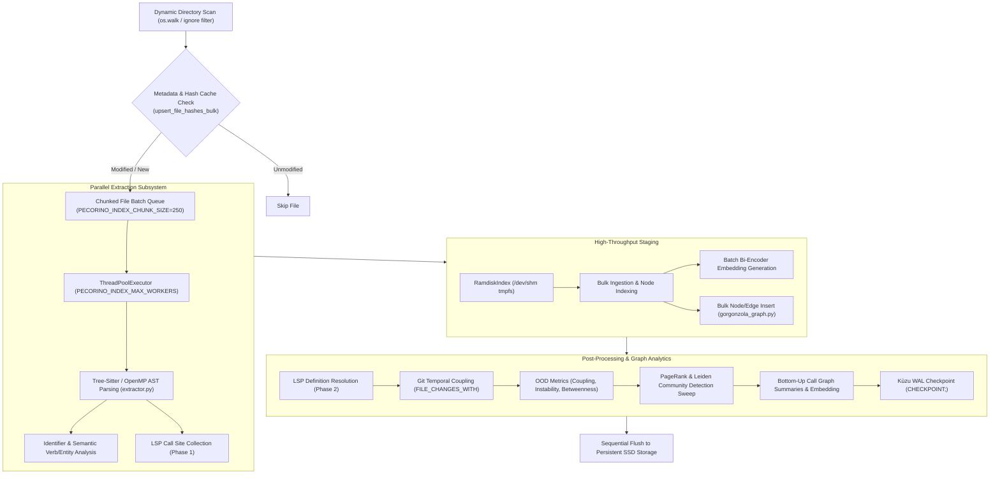
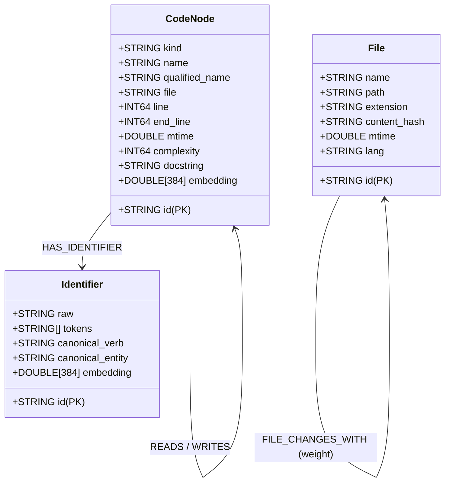
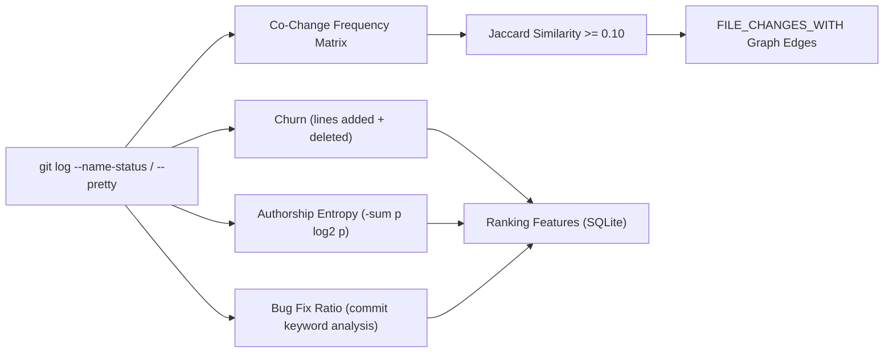

# Indexing Pipeline & Graph Architecture

Pecorino features a high-throughput, memory-conscious, incremental indexing pipeline coupled with an openCypher property graph engine (Gorgonzola / Kùzu). The pipeline transforms raw source code into structured AST nodes, dense vector embeddings, graph relationship topologies, and software evolutionary metrics.

---

## 1. Indexing Pipeline Architecture

The indexing pipeline orchestrates file discovery, multi-threaded AST parsing, vector embedding generation, graph relationship extraction, and database persistence:



---

## 2. Pipeline Components & Optimizations

### 2.1. `IndexProfiler` & Phase Observability
The indexing pipeline in [`index_pipeline.py`](file:///run/media/lechibang/work/projects/pecorino/src/mcp_server/index_pipeline.py) instruments every execution stage with [`IndexProfiler`](file:///run/media/lechibang/work/projects/pecorino/src/mcp_server/index_pipeline.py#L20-L40), tracking wall-clock time and profiling breakdowns:
- `Vector Embeddings Generation`: Dense embeddings generation across batch chunks.
- `Bulk Database Ingestion`: Tabular insertion of search nodes and metadata.
- `LSP Call Resolution`: Cross-file symbol reference lookup.
- `Git Temporal Coupling`: Commit co-change analysis and Jaccard matrix calculation.
- `Graph OOD Algorithms`: Calculation of graph topological metrics.
- `FTS Rebuild`: `c_fts_uring` index updates.

A complete summary is emitted upon index completion:
```text
=== Indexing Performance Profile ===
Vector Embeddings Generation  : 14.21s (42.3%)
Bulk Database Ingestion       : 8.52s  (25.4%)
LSP Call Resolution           : 5.10s  (15.2%)
Graph OOD Algorithms          : 3.25s  (9.7%)
Git Temporal Coupling         : 1.80s  (5.4%)
FTS Rebuild                   : 0.68s  (2.0%)
Total                         : 33.56s
====================================
```

### 2.2. RAM-Disk Staging (`ramdisk.py`)
To prevent SSD write amplification during initial indexing and large repository sweeps:
- [`RamdiskIndex`](file:///run/media/lechibang/work/projects/pecorino/src/mcp_server/ramdisk.py) stages the database files in `/dev/shm` (tmpfs).
- **Quota & Memory Protection**: Checks available tmpfs memory (`shutil.disk_usage('/dev/shm')`) against projected index requirements (~40× source code bytes). If memory is constrained, it automatically falls back to SSD direct writes without failing.
- **Atomic Synchronization**: When the indexing context exits, files are copied sequentially to SSD and the tmpfs staging directory is unlinked.

### 2.3. Incremental Dirty Tracking & File Watcher
- **Metadata Hash Cache**: [`upsert_file_hashes_bulk`](file:///run/media/lechibang/work/projects/pecorino/src/mcp_server/index_db.py) caches `(filepath, content_hash, mtime, lang)` tuples. Unmodified files (mtime delta < 0.01s and identical content hash) are skipped entirely during directory sweeps.
- **Dynamic File Watcher**: [`DebouncedFileEventHandler`](file:///run/media/lechibang/work/projects/pecorino/src/mcp_server/middleware/file_watcher.py) listens to filesystem modification events via `watchdog`, debounces rapid edits (default 2.0s window), and triggers granular updates for modified AST nodes and embeddings in real-time.

### 2.4. OpenMP & ThreadPoolExecutor Parallelism
- **Parallel Chunking**: Workloads are partitioned into chunked batches configured by `PECORINO_INDEX_CHUNK_SIZE=250`.
- **Worker Scaling**: Worker threads scale via `PECORINO_INDEX_MAX_WORKERS` (defaulting to 75% of logical CPU cores).
- **Native Parser Concurrency**: Native Tree-Sitter parsers utilize OpenMP threads for multi-core tokenization and AST generation.

---

## 3. Gorgonzola Graph Database

Pecorino utilizes **Gorgonzola** (a fork of the Kùzu embedded property graph engine) exposed through [`GorgonzolaGraph`](file:///run/media/lechibang/work/projects/pecorino/src/mcp_server/gorgonzola_graph.py) and [`GraphAPI`](file:///run/media/lechibang/work/projects/pecorino/src/mcp_server/graph_api.py).

### 3.1. Node & Relationship Schema
The graph model separates structural AST components from external and file entities:



- **Dedicated `File` Label**: Replaces generic `CodeNode` wrappers with dedicated `File` entities, drastically improving openCypher traversal efficiency for file-level queries.
- **Buffer Pool Allocation**: Managed with explicit buffer pool boundaries (`buffer_pool_size=256*1024*1024` or dynamic configuration) to maintain predictable memory ceilings under high concurrency.
- **Kùzu WAL Checkpointing**: Upon completing all indexing passes, the pipeline executes `CHECKPOINT;` against Kùzu, committing WAL frames to disk and ensuring fast read startup for subsequent query sessions.

---

## 4. Graph Analytics & Structural Algorithms

Implemented in [`graph_algorithms.py`](file:///run/media/lechibang/work/projects/pecorino/src/mcp_server/graph_algorithms.py):

### 4.1. PageRank & Personalized PageRank (PPR)
- **Global PageRank**: Computes authority scores across the call and dependency graph, persisting scores into SQLite's `code_nodes.pagerank` for retrieval score weighting.
- **Candidate Seed PPR (`compute_ppr_scores`)**: Evaluates localized PageRank over a 2-hop truncated candidate subgraph during query execution:
  $$p^{(t+1)} = \alpha p^{(0)} + (1 - \alpha) M p^{(t)}$$
  where teleport probability $\alpha = 0.15$ and power iterations $t = 10$.

### 4.2. ProNE Spectral Structural Embeddings (`compute_prone_embeddings`)
Generates 64-dimensional quantized `INT8` graph structural embeddings:
1. **Sparse Matrix Factorization**: Truncated SVD on the graph adjacency matrix:
   $$A \approx U_k \Sigma_k V_k^T, \quad E = U_k \Sigma_k^{1/2}$$
2. **Chebyshev Spectral Propagation**: High-order graph filtering over normalized Laplacian:
   $$\tilde{E} = 0.5 E + 0.3 \tilde{A} E + 0.2 \tilde{A}^2 E$$
3. **INT8 Quantization**: Clamps embeddings to $[-128, 127]$ for compact in-memory storage and fast Hamming / dot-product comparisons.

### 4.3. Betweenness Centrality & Object-Oriented Metrics
During graph post-processing (`_post_process_graph`):
- **Betweenness Centrality**: Identifies architectural bottleneck nodes bridging disparate functional modules by analyzing paths:
  $$\text{MATCH } (a)\text{-[:CALLS]->}(n)\text{-[:CALLS]->}(b) \text{ WHERE } a \neq b$$
- **Coupling & Instability**: Martin's metric calculated from incoming/outgoing degree:
  $$I = \frac{\text{OutDegree}}{\text{InDegree} + \text{OutDegree}}$$
- **Inheritance & Containment Depth**: Recursive graph path evaluation (`[:EXTENDS*]`, `[:CONTAINS*]`).

### 4.4. Leiden Community Detection & Gamma Sweep
- Runs native C++ Leiden clustering (`CALL leiden(...)`) across resolution parameters $\gamma \in [0.05 \dots 3.0]$.
- **Adjusted Rand Index (ARI)**: Computes contingency table agreements between consecutive gamma partitions in linear time.
- **Stability Detection**: Selects community partitions where ARI > 0.99, grouping related functions into cohesive architectural domains.

---

## 5. Git Evolution & Temporal Metrics

Extracted via [`GitDataCollector`](file:///run/media/lechibang/work/projects/pecorino/src/core/gitdatacollector.py) and [`_compute_git_features`](file:///run/media/lechibang/work/projects/pecorino/src/mcp_server/index_pipeline.py#L650-L740):



- **Temporal Coupling (`FILE_CHANGES_WITH`)**: Calculates Jaccard co-change similarity between pairs of files modified in the same commits:
  $$\text{Jaccard}(F_1, F_2) = \frac{|C(F_1) \cap C(F_2)|}{|C(F_1) \cup C(F_2)|}$$
  Pairs with Jaccard $\ge 0.10$ and at least 2 co-commits are inserted as `FILE_CHANGES_WITH` graph edges.
- **Authorship Entropy**: Measures knowledge distribution and code ownership concentration:
  $$H(F) = -\sum_{a \in \text{Authors}} p_a \log_2(p_a)$$
- **Historical Volatility**: Tracks total commit churn (lines added + lines deleted), survival days since creation, days since last change, and bug-fix commit ratio.

---

## 6. Configuration & Environment Variables

| Variable | Default | Description |
| :--- | :--- | :--- |
| `PECORINO_INDEX_CHUNK_SIZE` | `250` | Number of files processed per thread-pool batch. |
| `PECORINO_INDEX_MAX_WORKERS` | 75% × CPUs | Maximum concurrent worker threads for file parsing. |
| `PECORINO_ENABLE_OOD` | `true` | Enables graph post-processing for Betweenness, Coupling, and Instability. |
| `PECORINO_ALLOWED_EXTERNAL_DIRS` | `""` | Colon-separated list of external directory roots permitted for indexing. |
| `PECORINO_ENABLE_LSP` | `false` | Enables LSP background client pool for cross-file definition resolution. |
| `PECORINO_LSP_POOL_SIZE` | `2` | Number of concurrent LSP server subprocess instances. |
| `PECORINO_LSP_TIMEOUT` | `0.8` | Per-request timeout in seconds for LSP definition queries. |
| `PECORINO_INDEX_DIR` | `~/.pecorino/indexes` | Base filesystem directory for storing persistent SQLite, Gorgonzola, and FTS indexes. |
