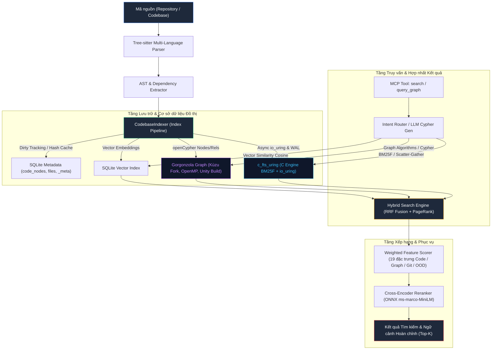
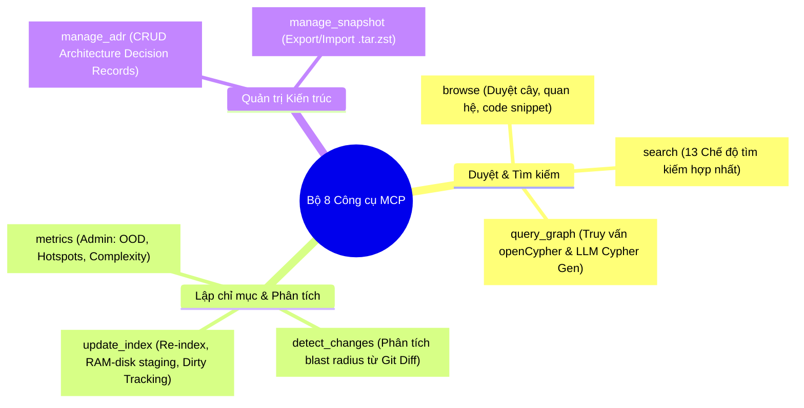
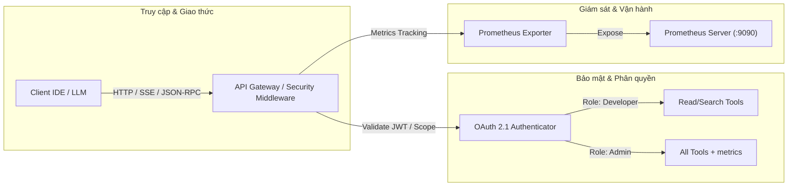
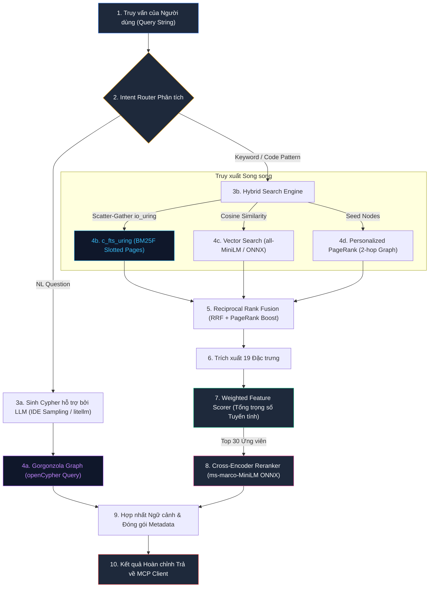

# Pecorino — Tài liệu Kiến trúc Hệ thống Kỹ thuật

> **Tài liệu Kỹ thuật Hệ thống Toàn diện**: Pipeline lập chỉ mục mã nguồn đa ngôn ngữ, động cơ tìm kiếm C `c_fts_uring` (Linux `io_uring` + `libuv`), cơ sở dữ liệu đồ thị thuộc tính Gorgonzola (openCypher), ngăn xếp Embedding / Cross-Encoder / Chấm điểm theo trọng số, bộ 8 công cụ MCP hoàn chỉnh, và hạ tầng vận hành quan sát.

---

## 1. Tổng quan Kiến trúc Hệ thống

**Pecorino** là một **MCP Server (Model Context Protocol)** hiệu năng cao phục vụ phân tích tĩnh, lập chỉ mục, điều hướng mã nguồn thông minh và truy vấn cơ sở dữ liệu đồ thị cho các hệ thống LLM / IDE Coding Assistants.

Hệ thống kết hợp chặt chẽ giữa:
1. **Frontend / Protocol Layer**: Chuẩn giao thức MCP hỗ trợ đầy đủ 8 công cụ (`browse`, `search`, `update_index`, `detect_changes`, `manage_adr`, `manage_snapshot`, `query_graph`, `metrics`), kiểm soát truy cập phân quyền RBAC (Admin / Developer) và xác thực chuẩn OAuth 2.1.
2. **Storage & Search Layer**: Động cơ lưu trữ & tìm kiếm C cấp thấp `c_fts_uring` (sử dụng Linux `io_uring` bất đồng bộ kết hợp `libuv`, phân trang Slotted Pages 4KB, Buffer Pool Manager Clock Eviction, WAL Micro-Transactions, POSIX Shared Memory zero-copy IPC) tích hợp trực tiếp vào SQLite dưới dạng Virtual Table `pecorino_ast`.
3. **Graph Database Layer**: Cơ sở dữ liệu đồ thị Gorgonzola (fork tối ưu hóa của Kùzu) hỗ trợ chuẩn truy vấn openCypher, tăng tốc đa luồng OpenMP, Unity build, nhãn node `File` chuyên biệt và cơ chế tự động WAL Checkpoint.
4. **Sinh truy vấn Cypher hỗ trợ bởi LLM**: Dịch truy vấn ngôn ngữ tự nhiên sang openCypher thông qua IDE Context Sampling với dự phòng local LLM qua `litellm` (suppress stdout stream).
5. **Embedding & Reranking Stack**: Bi-Encoder Embedding (MiniLM, Nomic, BGE), Reciprocal Rank Fusion (RRF), Chấm điểm theo trọng số đặc trưng (19 đặc trưng, tổng trọng số tuyến tính) và Cross-Encoder Reranker (MS MARCO MiniLM-L12).
6. **Infrastructure & Observability**: Bộ nhớ đệm RAM-Disk `/dev/shm` (giảm thiểu write amplification trên SSD), Dirty Tracking với SHA-256 hash caching, công cụ đo hiệu năng `IndexProfiler`, và hệ thống giám sát Prometheus Metrics.



---

## 2. Pipeline Lập chỉ mục Mã nguồn (Index Pipeline)

Quá trình lập chỉ mục mã nguồn trong Pecorino được tổ chức thành 3 giai đoạn xử lý chính, được điều phối bởi lớp [`CodebaseIndexer`](file:///run/media/lechibang/work/projects/pecorino/src/mcp_server/index_pipeline.py#L56).

```mermaid
sequenceDiagram
    autonumber
    participant FS as Hệ thống File (Disk/Git)
    participant Pipe as CodebaseIndexer
    participant Parser as Tree-sitter Parser
    participant DB as SQLite (index_db.py)
    participant FTS as c_fts_uring Engine
    participant Graph as Gorgonzola Graph
    participant ML as Embedding Pipeline

    Pipe->>FS: Quét danh sách file & kiểm tra Git status
    Pipe->>DB: Truy vấn metadata bảng `files` (mtime, SHA-256 hash)
    Note over Pipe,DB: Dirty Tracking: Bỏ qua file chưa chỉnh sửa
    
    par Phân tích cú pháp song song (ThreadPool)
        Pipe->>Parser: Phân tích cú pháp AST qua Tree-sitter
        Parser-->>Pipe: Trả về AST Nodes & Quan hệ (Edges)
    and Trích xuất Đặc trưng
        Pipe->>FS: Tính toán Git Churn, Survival Days, Entropy
        Pipe->>Pipe: Tính toán OOD Metrics (Coupling, Instability, Depth)
    end

    Pipe->>DB: Batch Insert metadata vào `code_nodes` & `files`
    Pipe->>FTS: `python_insert_document` (Slotted Pages, WAL, Positional Index)
    Pipe->>Graph: Bulk load Nodes (`File`, `CodeNode`, `Identifier`) & Edges
    Pipe->>ML: Sinh Vector Embeddings theo batch (384 chiều)
    
    Pipe->>Graph: Tính toán PageRank & Leiden Community Detection
    Pipe->>Pipe: Xây dựng tóm tắt đồ thị gọi hàm từ dưới lên (Bottom-up)
    Pipe->>Graph: Thực thi `CHECKPOINT;` đóng băng WAL
    Pipe->>FTS: Flush buffer pool & Sync state
```

### 2.1 Giai đoạn 1: Phân tích cú pháp AST (Parsing)

| Thành phần | Đường dẫn | Mô tả chức năng |
|---|---|---|
| `TreeSitterParser` | [`src/parsers/tree_sitter_parser.py`](file:///run/media/lechibang/work/projects/pecorino/src/parsers/tree_sitter_parser.py) | Parser cốt lõi tích hợp thư viện `tree-sitter`, sinh cây cú pháp trừu tượng (AST) với hiệu năng native |
| `TreeSitterExtractor` | [`src/mcp_server/ast/extractor.py`](file:///run/media/lechibang/work/projects/pecorino/src/mcp_server/ast/extractor.py) | Trích xuất các node ngữ nghĩa (hàm, lớp, phương thức, biến, interface) và quan hệ cấu trúc |

**Ngôn ngữ được hỗ trợ và các tệp truy vấn Tree-sitter SCM tương ứng:**

| Ngôn ngữ | Thư viện Tree-sitter | Tệp định nghĩa truy vấn (SCM Queries) |
|---|---|---|
| **Python** | `tree-sitter-python` | [`python.scm`](file:///run/media/lechibang/work/projects/pecorino/src/parsers/queries/python.scm) |
| **Java** | `tree-sitter-java` | [`java.scm`](file:///run/media/lechibang/work/projects/pecorino/src/parsers/queries/java.scm) |
| **JavaScript** | `tree-sitter-javascript` | [`javascript.scm`](file:///run/media/lechibang/work/projects/pecorino/src/parsers/queries/javascript.scm) |
| **TypeScript** | `tree-sitter-typescript` | [`typescript.scm`](file:///run/media/lechibang/work/projects/pecorino/src/parsers/queries/typescript.scm) |
| **C / C++** | `tree-sitter-c`, `tree-sitter-cpp` | [`cpp.scm`](file:///run/media/lechibang/work/projects/pecorino/src/parsers/queries/cpp.scm) |
| **Go** | `tree-sitter-go` | [`go.scm`](file:///run/media/lechibang/work/projects/pecorino/src/parsers/queries/go.scm) |
| **Rust** | `tree-sitter-rust` | [`rust.scm`](file:///run/media/lechibang/work/projects/pecorino/src/parsers/queries/rust.scm) |
| **Ruby** | `tree-sitter-ruby` | [`ruby.scm`](file:///run/media/lechibang/work/projects/pecorino/src/parsers/queries/ruby.scm) |
| **Swift** | `tree-sitter-swift` | [`swift.scm`](file:///run/media/lechibang/work/projects/pecorino/src/parsers/queries/swift.scm) |
| **Kotlin** | `tree-sitter-kotlin` | Hỗ trợ qua AST Parser chuẩn |
| **C#** | `tree-sitter-c-sharp` | Hỗ trợ qua AST Parser chuẩn |
| **Scala** | `tree-sitter-java` | Kế thừa mô hình Java AST |

**Các loại Node được trích xuất:**
- `File`: Node đại diện cho tệp nguồn, lưu thông tin hash, mtime, ngôn ngữ.
- `Class` / `Interface`: Lớp và giao diện lập trình hướng đối tượng.
- `Function` / `Method` / `Lambda`: Khối thực thi logic, hàm toàn cục, phương thức đối tượng hoặc hàm ẩn danh.
- `Symbol` / `Variable` / `Identifier`: Định danh biến, hằng số, tham số.
- `ControlFlow` / `Module`: Khối rẽ nhánh, luồng điều khiển, namespace/module.

**Các loại Quan hệ (Edges) được trích xuất:**
- `CONTAINS`: File chứa Class/Function/Method.
- `CALLS` / `RECURSES_TO`: Hàm gọi hàm khác hoặc tự đệ quy.
- `IMPORTS`: Tệp hoặc module nhập phụ thuộc từ tệp/gói khác.
- `INHERITS` / `EXTENDS` / `IMPLEMENTS`: Kế thừa lớp, mở rộng và hiện thực hóa interface.
- `PARAMETER_OF` / `RETURNS`: Tham số đầu vào và kiểu dữ liệu trả về của hàm.
- `READS` / `WRITES` / `ACCESSES_STATE`: Truy cập đọc/ghi trạng thái đối tượng hoặc biến toàn cục.
- `DATA_FLOWS_TO`: Luồng lan truyền dữ liệu (Data-flow & Taint tracking).
- `HAS_IDENTIFIER`: Liên kết node với token định danh đã được chuẩn hóa ngữ nghĩa.
- `CONTAINS_LAMBDA`: Hàm chứa biểu thức lambda con.
- `TESTS` / `RAISES` / `HTTP_CALLS`: Quan hệ kiểm thử, phát sinh ngoại lệ, và gọi API dịch vụ từ xa.

---

### 2.2 Giai đoạn 2: Phân giải phụ thuộc (Dependency Resolution)

Mô-đun phân giải phụ thuộc đa ngôn ngữ trong [`index_pipeline.py`](file:///run/media/lechibang/work/projects/pecorino/src/mcp_server/index_pipeline.py) ánh xạ các câu lệnh import thành liên kết cạnh (graph edges) chính xác giữa các tệp trong cây dự án:

| Ngôn ngữ | Chiến lược Phân giải Phụ thuộc (Resolution Strategy) |
|---|---|
| **JavaScript / TypeScript** | Đường dẫn tương đối (`./`, `../`) $\rightarrow$ Phân giải module nội bộ $\rightarrow$ `node_modules` $\rightarrow$ `package.json` (`main`/`exports`) $\rightarrow$ File dự phòng `index.{js,ts,tsx}` |
| **C / C++** | Thư mục cục bộ của file $\rightarrow$ Repo root $\rightarrow$ Thư mục `include/` $\rightarrow$ Thư mục `src/include/` $\rightarrow$ Quét tìm kiếm Header toàn repository |
| **Python** | Đếm số dấu chấm tương đối (`from ..module import`) $\rightarrow$ Phân giải đường dẫn module tuyệt đối dựa trên `PYTHONPATH` $\rightarrow$ Khởi tạo qua `__init__.py` |
| **Go** | Đọc module name từ `go.mod` $\rightarrow$ Ánh xạ package namespace $\rightarrow$ Phân giải đường dẫn thư mục nội bộ |
| **Rust** | Tách toán tử phạm vi `::` (`crate::`, `super::`) $\rightarrow$ Ánh xạ file `.rs` tương ứng hoặc `mod.rs` / `lib.rs` / `main.rs` |

---

### 2.3 Giai đoạn 3: Lập chỉ mục và Lưu trữ (Indexing & Persistence)

Lớp [`CodebaseIndexer`](file:///run/media/lechibang/work/projects/pecorino/src/mcp_server/index_pipeline.py#L56) thực hiện toàn bộ chu trình lập chỉ mục với cơ chế tối ưu hóa dirty tracking:

1. **Dirty Tracking & Hash Caching (`upsert_file_hashes_bulk`)**:
   - So sánh `mtime` và tính toán SHA-256 hash của từng tệp với bảng `files` trong SQLite.
   - Bỏ qua các tệp không thay đổi (`skipped_files`), chỉ nạp và phân tích lại các tệp đã sửa đổi (`indexed_files`), giúp tốc độ re-index trên các codebase hàng triệu dòng code đạt mức gần như tức thì.
   - Dọn dẹp các node mồ côi khi tệp bị xóa (`stale_files_removed`).
2. **Phân tích Cú pháp Song song (Parallel Parsing)**:
   - Sử dụng `ThreadPoolExecutor` với số luồng tự động cấu hình tối ưu = 75% tổng số CPU cores.
3. **Lưu trữ Cấp thấp `c_fts_uring`**:
   - Nạp tài liệu trực tiếp vào động cơ C qua `python_insert_document` (ghi đồng thời Term Frequency, Document Length, Vector Embedding, và Metadata vào Slotted Pages + WAL).
4. **Lưu trữ Đồ thị Gorgonzola**:
   - Ghi các bảng Node (`File`, `CodeNode`, `Identifier`) và Relationship Tables theo từng lô (bulk batch COPY / CSV staging).
5. **Tóm tắt đồ thị gọi hàm từ dưới lên (Bottom-Up Summarization)**:
   - Sinh tóm tắt từ lá (leaf functions) lên gốc (entry points) bằng sắp xếp topo và nối chuỗi, không cần gọi LLM.
6. **Tính toán Chỉ số Cấu trúc, OOD & Git Metrics**:
   - Chạy thuật toán PageRank, Leiden Community Detection, ProNE Embedding.
   - Tính toán Coupling ($C_a$, $C_e$), Instability ($I$), Cyclomatic Complexity, và Git Churn / Bug Fix Ratio.
7. **Tự động Checkpoint WAL của Gorgonzola (`0d87d1f`)**:
   - Ngay sau khi hoàn thành chu trình ghi dữ liệu đồ thị, pipeline lập tức phát lệnh `CHECKPOINT;` tới Gorgonzola. Cơ chế này xóa sạch tệp WAL tạm thời, nén cấu trúc đồ thị xuống đĩa, loại bỏ hoàn toàn hiện tượng chậm/treo (cold start lag) khi các tiến trình đọc (query clients) mở cơ sở dữ liệu ở chế độ read-only.

---

### 2.4 Tối ưu hóa Staging RAM-Disk & Giám sát IndexProfiler

#### A. RAM-Disk Staging ([`ramdisk.py`](file:///run/media/lechibang/work/projects/pecorino/src/mcp_server/ramdisk.py))
Để giải quyết bài toán write amplification và tối đa hóa tốc độ ghi I/O ngẫu nhiên khi xây dựng index lớn:
- Lớp `RamdiskIndex` tự động khởi tạo thư mục làm việc tạm thời trong `/dev/shm` (tmpfs chạy hoàn toàn trên RAM).
- Toàn bộ cơ sở dữ liệu SQLite, `c_fts_uring` shards, và Gorgonzola storage được tạo lập và cập nhật trực tiếp trong RAM.
- Sau khi quá trình lập chỉ mục kết thúc và WAL đã được checkpoint, hệ thống thực hiện đồng bộ một lần duy nhất (`atomic sync/copy`) sang ổ đĩa SSD đích.

#### B. Trình giám sát hiệu năng IndexProfiler
Lớp [`IndexProfiler`](file:///run/media/lechibang/work/projects/pecorino/src/mcp_server/index_pipeline.py#L20) tích hợp sẵn trong pipeline, đo lường chính xác từng phần trăm thời gian thực thi:
- Phân tích cú pháp Tree-sitter (Parsing)
- Ghi dữ liệu AST vào cơ sở dữ liệu (DB Insertion)
- Lập chỉ mục toàn văn bản C-Engine (`c_fts_uring`)
- Sinh Vector Embeddings
- Sinh tóm tắt đồ thị gọi hàm từ dưới lên
- Tính toán thuật toán đồ thị (PageRank, Leiden, ProNE)
- Trích xuất lịch sử Git & OOD Metrics

---

## 3. Cơ sở dữ liệu và Động cơ Lưu trữ

Hệ sinh thái lưu trữ của Pecorino được thiết kế kết hợp 2 thành phần chuyên biệt hóa cao: **SQLite với Virtual Table `c_fts_uring`** và **Cơ sở dữ liệu Đồ thị Gorgonzola**.

### 3.1 SQLite & SQLite Virtual Table `pecorino_ast`

File quản trị: [`src/mcp_server/index_db.py`](file:///run/media/lechibang/work/projects/pecorino/src/mcp_server/index_db.py)

#### Bảng `code_nodes` (Lưu trữ Metadata và Chỉ số phân tích)
Bảng trung tâm quản lý mọi thực thể mã nguồn:

| Tên Cột | Kiểu Dữ liệu | Ý nghĩa Kỹ thuật |
|---|---|---|
| `id` | `VARCHAR` (PK) | Khóa định danh duy nhất: `filepath::kind::qualified_name::start_line` |
| `uuid` | `BLOB` (16 bytes) | UUID 128-bit nhị phân kết nối trực tiếp với khóa chính trong `c_fts_uring` |
| `name` | `VARCHAR` | Tên của symbol (hàm, biến, class) |
| `kind` | `VARCHAR` | Loại node (`function`, `class`, `method`, `interface`, ...) |
| `filepath` | `VARCHAR` | Đường dẫn tuyệt đối của tệp nguồn |
| `start_line` / `end_line` | `INTEGER` | Dòng bắt đầu và dòng kết thúc trong file (1-indexed) |
| `start_byte` / `end_byte` | `INTEGER` | Offset byte chính xác trong tệp phục vụ lazy-load mã nguồn |
| `pagerank` | `DOUBLE` | Điểm số PageRank đồ thị |
| `complexity` | `INTEGER` | Độ phức tạp Cyclomatic (McCabe Complexity) |
| `in_degree` / `out_degree` | `INTEGER` | Bậc vào (số lượng caller) và Bậc ra (số lượng callee) |
| `hcgs_summary` | `VARCHAR` | Tóm tắt sinh tự động bằng duyệt đồ thị gọi hàm từ dưới lên |
| `community_id` | `INTEGER` | Mã phân cụm cộng đồng theo thuật toán Leiden |
| `git_commit_count` | `INTEGER` | Tổng số lần commit tác động lên node/file |
| `git_days_since_change`| `INTEGER` | Số ngày trôi qua kể từ lần sửa đổi gần nhất |
| `git_churn` | `INTEGER` | Tổng lượng dòng code thêm/xóa trong lịch sử git |
| `git_authors` | `INTEGER` | Số lượng lập trình viên từng sửa đổi |
| `git_bug_fix_ratio` | `DOUBLE` | Tỷ lệ commit sửa lỗi liên quan (`fix`, `bug`, `patch`) |
| `git_survival_days` | `INTEGER` | Tuổi thọ tồn tại của file (ngày) |
| `git_ownership_entropy`| `DOUBLE` | Entropy phân tán quyền sở hữu code giữa các tác giả |
| `instability` | `DOUBLE` | Độ bất ổn định OOD: $I = \frac{C_e}{C_e + C_a}$ |
| `coupling` | `DOUBLE` | Độ ghép nối tổng hợp ($C_a + C_e$) |
| `depth` | `INTEGER` | Độ sâu trong cây kế thừa và phân cấp phụ thuộc |
| `betweenness` | `DOUBLE` | Điểm trung gian Betweenness Centrality trong call graph |

#### Bảng `files` (Quản lý trạng thái và Dirty Tracking)
| Tên Cột | Kiểu Dữ liệu | Ý nghĩa Kỹ thuật |
|---|---|---|
| `filepath` | `VARCHAR` (PK) | Đường dẫn tệp |
| `content_hash` | `VARCHAR` | SHA-256 hash nội dung tệp |
| `mtime` | `DOUBLE` | Thời điểm sửa đổi file gần nhất trên hệ thống tệp |
| `lang` | `VARCHAR` | Ngôn ngữ lập trình được nhận dạng |

#### Bảng `embeddings_cache` (Bộ nhớ đệm Vector)
| Tên Cột | Kiểu Dữ liệu | Ý nghĩa Kỹ thuật |
|---|---|---|
| `text_hash` | `VARCHAR` (PK) | SHA-256 hash của chuỗi văn bản đầu vào |
| `text` | `VARCHAR` | Chuỗi văn bản gốc đã trích xuất |
| `embedding` | `FLOAT[384]` | Vector đặc trưng ngữ nghĩa 384 chiều |
| `model` | `VARCHAR` | Tên mô hình embedding đã sử dụng |

---

### 3.2 Gorgonzola — Cơ sở dữ liệu Đồ thị Thuộc tính (openCypher)

File quản trị: [`src/mcp_server/gorgonzola_graph.py`](file:///run/media/lechibang/work/projects/pecorino/src/mcp_server/gorgonzola_graph.py)

**Gorgonzola** là bản fork hiệu năng cao được tùy biến từ **Kùzu Graph Database Engine**:
- **Ngôn ngữ truy vấn**: Chuẩn openCypher toàn diện (`MATCH`, `WHERE`, `RETURN`, `WITH`, `ORDER BY`, `LIMIT`).
- **Tối ưu hóa đa luồng OpenMP**: Khả năng mở rộng xử lý đồ thị song song trên hệ thống đa nhân (multi-core scaling).
- **Tăng tốc biên dịch Unity Build**: Gom nhóm các tệp nguồn C++ trong quá trình build, giảm thiểu thời gian biên dịch và tối ưu hóa inline code.
- **Tách biệt nhãn `File` chuyên biệt**: Sử dụng `CREATE NODE TABLE File (...)` riêng biệt thay vì gộp chung vào `CodeNode`, giúp tăng tốc các truy vấn phụ thuộc tệp và tính toán PageRank ở cấp độ module.
- **Tự động Checkpoint WAL**: Đồng bộ hóa dữ liệu từ Write-Ahead Log vào Storage Chunks ngay khi kết thúc lập chỉ mục.

**Bảng Node trong Gorgonzola:**

| Bảng Node | Các thuộc tính chính (Properties) | Mục đích lưu trữ |
|---|---|---|
| `File` | `id` (PK), `name`, `path`, `extension`, `content_hash`, `mtime`, `lang` | Quản lý tệp mã nguồn và ranh giới module |
| `CodeNode` | `id` (PK), `kind`, `name`, `qualified_name`, `file`, `line`, `end_line`, `complexity`, `docstring`, `embedding DOUBLE[384]` | Đại diện cho thực thể code (hàm, class, method) |
| `Identifier` | `id` (PK), `raw`, `tokens[]`, `case_style`, `prefix`, `suffix`, `verb`, `entity`, `qualifier`, `canonical_verb`, `canonical_entity`, `domain`, `intent`, `embedding DOUBLE[384]` | Phân tích ngữ nghĩa tên biến và hàm |

**22 Loại Bảng Quan hệ (Relationship Tables):**
`HAS_IDENTIFIER`, `CONTAINS`, `CALLS`, `IMPORTS`, `INHERITS`, `PARAMETER_OF`, `RETURNS`, `DEPENDS_ON`, `DEFINES`, `EXTENDS`, `IMPLEMENTS`, `FILE_CHANGES_WITH`, `RAISES`, `TESTS`, `HTTP_CALLS`, `READS`, `WRITES`, `HAS_PARAMETER`, `USES`, `CONTAINS_LAMBDA`, `ACCESSES_STATE`, `RECURSES_TO`.

---

### 3.3 GraphAPI — Giao diện Lập trình Đồ thị Chuẩn hóa

File: [`src/mcp_server/graph_api.py`](file:///run/media/lechibang/work/projects/pecorino/src/mcp_server/graph_api.py)

Thay thế hoàn toàn cấu trúc `FederatedGraphAPI` cũ, `GraphAPI` chuẩn hóa là giao diện trực tiếp kết nối ứng dụng với Gorgonzola:
- **Thread-Safe PageRank Caching**: Tích hợp khóa `_pagerank_lock` và bộ nhớ đệm `_pagerank_cache` tránh tính toán lại lặp đi lặp lại.
- **Truy vết Quan hệ Cuộc gọi**: Cung cấp các phương thức tiện ích `get_callers`, `get_callees`, `trace_calls` hỗ trợ duyệt đồ thị đa tầng (multi-hop graph traversal).
- **Phân tích Purity & Phụ thuộc Tệp**: Phương thức `get_file_dependencies` và `analyze_functional_purity` truy vấn nhanh các cạnh `DEPENDS_ON` và `READS`/`WRITES`.

---

## 4. Động cơ Tìm kiếm `c_fts_uring` & Kiến trúc Tìm kiếm Lai

Pecorino đã loại bỏ hoàn toàn engine Tantivy cũ và thay thế bằng **`c_fts_uring`** — một động cơ lưu trữ & tìm kiếm C chuyên dụng được thiết kế tối ưu hóa cho hệ điều hành Linux.

```
┌─────────────────────────────────────────────────────────────────────────────┐
│                            c_fts_uring C Engine                             │
├─────────────────────────────────────────────────────────────────────────────┤
│  ┌───────────────────────┐  ┌───────────────────────┐  ┌──────────────────┐ │
│  │   Linux io_uring      │  │      libuv Loop       │  │  POSIX SHM (IPC) │ │
│  │ (Async Disk I/O Ring) │  │(Scatter-Gather Events)│  │(shm_open Zero-cp)│ │
│  └──────────┬────────────┘  └───────────┬───────────┘  └────────┬─────────┘ │
│             │                           │                       │           │
│  ┌──────────▼───────────────────────────▼───────────────────────▼─────────┐ │
│  │              Buffer Pool Manager (Clock Eviction Algorithm)            │ │
│  │      - 8/16 Frame Page Cache       - Dirty Page Tracking & Pinning     │ │
│  │      - HINT_SEQUENTIAL_SCAN        - Page Eviction & Flush Policy      │ │
│  └──────────────────────────────────────┬─────────────────────────────────┘ │
│                                         │                                   │
│  ┌──────────────────────────────────────▼─────────────────────────────────┐ │
│  │                 Write-Ahead Logging (WAL) & Micro-Transactions         │ │
│  │      - Append-Only LSN Log         - Sequential Crash Recovery Engine  │ │
│  └──────────────────────────────────────┬─────────────────────────────────┘ │
│                                         │                                   │
│  ┌──────────────────────────────────────▼─────────────────────────────────┐ │
│  │                       Slotted Pages Storage (4KB Pages)                │ │
│  │  Page Header: [CRC32 Checksum | LSN | Slot Count | Free Ptr | PageType]│ │
│  │  Page Types: ROW, BTREE_LEAF, BTREE_INTERNAL, LENGTH_MAP, TOMBSTONE    │ │
│  └──────┬───────────────────────┬───────────────────────────┬─────────────┘ │
│         │                       │                           │               │
│  ┌──────▼─────────────┐  ┌──────▼──────────────┐  ┌─────────▼─────────────┐ │
│  │ B-Tree Primary Key │  │ Quantized Length Map│  │   Tombstone Bitsets   │ │
│  │    Index (O(log N))│  │  BM25 Length Map    │  │   Deletion Bitset    │ │
│  └────────────────────┘  └─────────────────────┘  └───────────────────────┘ │
│  ┌────────────────────────────────────────────────────────────────────────┐ │
│  │    Inverted Postings Index: Positional Indexing (Phrase Matching)      │ │
│  │    BM25 Dynamic Field Boosting: [name: 5.0, kind: 4.0, doc: 3.0, ...]  │ │
│  └────────────────────────────────────────────────────────────────────────┘ │
└─────────────────────────────────────────────────────────────────────────────┘
```

### 4.1 Chi tiết Kiến trúc Động cơ C `c_fts_uring`

Mã nguồn tại [`modules/c_fts_uring`](file:///run/media/lechibang/work/projects/pecorino/modules/c_fts_uring) và bindings Python tại [`src/mcp_server/fts_uring_bindings.py`](file:///run/media/lechibang/work/projects/pecorino/src/mcp_server/fts_uring_bindings.py):

1. **Linux `io_uring` + `libuv` Event Loop**:
   - Tận dụng ring buffer bất đồng bộ cấp kernel của Linux (`io_uring`) để thực hiện các thao tác đọc/ghi trang đĩa không chặn (non-blocking zero-copy disk I/O).
   - Tích hợp `libuv` để xây dựng mô hình **Scatter-Gather Multi-Shard Search**, phân tán truy vấn tới nhiều shard song song và tổng hợp kết quả mà không gây nghẽn CPU.
2. **Cấu trúc Trang Slotted Pages 4KB (`slotted_page.c`)**:
   - Kích thước trang cố định 4096 bytes tiêu chuẩn của Linux page cache.
   - **Header 24-byte** bao gồm: Mã kiểm tra toàn vẹn CRC32, Log Sequence Number (LSN), số lượng slots, con trỏ vùng trống (free space offset), và định danh kiểu trang (`PAGE_TYPE_ROW`, `PAGE_TYPE_BTREE_LEAF`, `PAGE_TYPE_BTREE_INTERNAL`, `PAGE_TYPE_LENGTH_MAP`, `PAGE_TYPE_TOMBSTONE_BITSET`).
   - Hỗ trợ giải thuật chống phân mảnh trang tự động (page defragmentation).
3. **Buffer Pool Manager & Clock Eviction (`buffer_pool.c`)**:
   - Quản lý bộ nhớ đệm trang nhiều frame trong RAM.
   - Áp dụng thuật toán **Clock Eviction** để chọn trang loại bỏ khi cache đầy.
   - Hỗ trợ cơ chế ghim trang (`frame pinning`), đánh dấu trang bẩn (`dirty bit tracking`), và chỉ dẫn quét tuần tự `HINT_SEQUENTIAL_SCAN` để chống ô nhiễm cache (cache thrashing).
4. **Write-Ahead Logging (WAL) & Phục hồi Sự cố (`wal.c`)**:
   - Mọi thay đổi dữ liệu (micro-transactions) đều được ghi tuần tự vào append-only WAL trước khi trang bẩn được đẩy xuống đĩa.
   - Đảm bảo tính toàn vẹn dữ liệu ACID và khả năng phục hồi tức thì sau sự cố (crash recovery via sequential replay).
5. **POSIX Shared Memory Zero-Copy IPC (`shm_manager.c`)**:
   - Sử dụng `shm_open` và `mmap` để chia sẻ trực tiếp vùng nhớ buffer pool giữa tiến trình C và Python/SQLite, loại bỏ hoàn toàn chi phí sao chép dữ liệu giữa các tiến trình.
6. **Chỉ mục B-Tree Primary Key (`btree.c`)**:
   - Chỉ mục B-Tree đa tầng ánh xạ UUID 128-bit của node tới địa chỉ `(page_id, slot_id)` trên đĩa với độ phức tạp $O(\log N)$.
   - Tự động tách trang (leaf node split) và tích hợp ghi log transaction WAL.
7. **Quantized Length Maps (`fts_indexer.c`)**:
   - Lượng tử hóa độ dài trường văn bản từ số nguyên `uint32` (4 bytes) về `uint8` (1 byte) theo thang logarit.
   - Cho phép bộ tính điểm BM25 đọc độ dài tài liệu để chuẩn hóa điểm số mà không cần bóc tách tuple trong slotted pages.
8. **Tombstone Bitsets**:
   - Quản lý trạng thái xóa tài liệu bằng mảng bitset nhị phân.
   - Lọc bỏ tài liệu đã xóa trong quá trình quét FTS bằng kiểm tra bit.
9. **Positional Indexing (Tìm kiếm Cụm từ Chính xác)**:
   - Danh sách nghịch đảo (inverted postings list) lưu trữ chi tiết vị trí từ (word positions).
   - Hỗ trợ truy vấn cụm từ chính xác (exact phrase search, proximity search).
10. **Trọng số Trường Động (Dynamic Field Weights) BM25**:
    - `name`: **5.0** (Tên symbol — ưu tiên hàng đầu)
    - `kind` / `docstring`: **4.0** (Kiểu dữ liệu và tài liệu hàm)
    - `summary`: **3.0** (Tóm tắt đồ thị gọi hàm)
    - `filepath` / `body`: **1.0 - 2.0** (Đường dẫn và mã nguồn chi tiết)

---

### 4.2 SQLite Virtual Table `pecorino_ast` & Tìm kiếm Hợp nhất RRF

Động cơ `c_fts_uring` được nạp vào SQLite thông qua giao diện Virtual Table:

```sql
CREATE VIRTUAL TABLE IF NOT EXISTS pecorino_ast 
USING fts_uring('/path/to/repo_fts', 6144);
```

Khi thực hiện tìm kiếm, Pecorino kết hợp kết quả BM25F từ `c_fts_uring`, điểm tương đồng ngữ nghĩa Vector Cosine, và điểm PageRank từ Gorgonzola thông qua câu lệnh SQL tối ưu:

```sql
SELECT c.id, c.name, c.kind, c.filepath, c.start_line, c.end_line, c.start_byte, c.end_byte,
       a.bm25f_score AS bm25_score,
       ((a.rrf_score) * (1.0 + COALESCE(c.pagerank, 0.0))) AS score,
       a.cosine_score AS vec_sim
FROM pecorino_ast a
JOIN code_nodes c ON lower(hex(c.uuid)) = a.node_id
WHERE a.query MATCH ?
ORDER BY score DESC
LIMIT ? OFFSET ?;
```

**Công thức RRF (Reciprocal Rank Fusion):**
$$RRF\_Score(d) = \sum_{m \in \{BM25, Vector\}} \frac{1}{k + rank_m(d)} \quad (k = 60)$$

Điểm RRF sau đó được nhân với trọng số ảnh hưởng của cấu trúc đồ thị: $(1.0 + PageRank(d))$.

---

### 4.3 Intent Router & Sinh truy vấn Cypher hỗ trợ bởi LLM

#### A. Intent Router ([`intent_router.py`](file:///run/media/lechibang/work/projects/pecorino/src/mcp_server/intent_router.py))
Bộ phân loại định tuyến truy vấn người dùng tự động dựa trên mẫu biểu thức chính quy (Regex Heuristics):

| Mẫu Regex Truy vấn | Chế độ được định tuyến (Mode) | Trích xuất tham số |
|---|---|---|
| `"who calls OrderHandler?"` / `"callers of X"` | `callers` | Query: `OrderHandler` |
| `"what does OrderHandler call?"` | `callees` | Query: `OrderHandler` |
| `"impact of utils.py"` / `"what depends on X"` | `impact` | Query: `utils.py` |
| `"related to OrderHandler"` / `"community X"` | `community` | Query: `OrderHandler` |
| `"dead code"` / `"unused code"` | `intent` | Intent: `dead_code` |
| `"entry points"` | `intent` | Intent: `entry_points` |
| `"all classes"` / `"list functions"` | `intent` | Intent: `all_classes` / `all_functions` |
| `"MATCH (a)... RETURN..."` | `cypher` | Query: Cypher string |
| *Mọi truy vấn tìm kiếm khác* | `hybrid` | Truy vấn lai mặc định |

#### B. Sinh truy vấn Cypher hỗ trợ bởi LLM ([`llm_client.py`](file:///run/media/lechibang/work/projects/pecorino/src/mcp_server/llm_client.py))
Khi người dùng gửi câu hỏi ngôn ngữ tự nhiên vào công cụ `query_graph` (hoặc `search` mode `cypher`):
1. **IDE Context Sampling First**: Ưu tiên sử dụng tính năng MCP Sampling của IDE (`ctx.create_message`) để yêu cầu mô hình LLM của IDE dịch câu hỏi sang câu lệnh openCypher hợp lệ theo schema của Gorgonzola.
2. **Fallback về Local LLM qua `litellm`**: Nếu IDE không hỗ trợ sampling hoặc gặp lỗi kết nối, hệ thống tự động fallback về mô hình cục bộ (cấu hình qua biến môi trường `PECORINO_LLM_MODEL`, mặc định `ollama/llama3`).
3. **Bảo vệ luồng MCP (Stream Protection)**: Tự động thiết lập `litellm.suppress_debug_info = True` và chuyển hướng `sys.stdout` sang `sys.stderr` trong suốt quá trình LLM suy luận, ngăn chặn hoàn toàn việc các thông báo log làm hỏng luồng JSON-RPC của giao thức MCP.
4. **Kiểm tra An toàn Chỉ đọc (Read-Only Enforcement)**: Chặn các từ khóa sửa đổi (`CREATE`, `MERGE`, `SET`, `DELETE`, `DROP`), ép giới hạn `LIMIT 50`, và thay thế hàm `type()` bằng `LABEL()` theo chuẩn Gorgonzola.

---

## 5. Embedding, Scoring và Reranking

```
Truy vấn / Tài liệu
        │
        ├──► [Bi-Encoder: SentenceTransformer / ONNX] ──► Vector 384-dim (Cosine Similarity)
        │
        ├──► [c_fts_uring Engine] ──────────────────────► BM25F Score
        │
        ├──► [Gorgonzola Graph & Git Data] ─────────────► PageRank, Churn, OOD Metrics
        │                                                        │
        └───────────────────────────┬────────────────────────────┘
                                    ▼
                     [Weighted Feature Scorer]
                     (19 Đặc trưng, Tổng trọng số Tuyến tính)
                                    │ Top 30 Ứng viên
                                    ▼
                   [Cross-Encoder Reranker (ONNX)]
                   ms-marco-MiniLM-L-12-v2 (Sigmoid Scored)
                                    │
                                    ▼
                         Kết quả Xếp hạng Cuối cùng
```

### 5.1 Bi-Encoder: Embedding Pipeline

Hệ thống hỗ trợ 2 pipeline sinh vector embedding:

#### A. Sentence Transformer Embedder ([`embedder.py`](file:///run/media/lechibang/work/projects/pecorino/src/mcp_server/embedder.py))
- **Mô hình**: `all-MiniLM-L12-v2` (12-layer MiniLM distilled từ BERT).
- **Kích thước Vector**: **384 chiều**.
- **Bộ nhớ đệm**: Lưu trữ cache trong bảng SQLite `embeddings_cache` theo SHA-256 hash của văn bản.
- **Fallback**: Tự động chuyển sang `fastembed` nếu môi trường không có PyTorch.

#### B. ONNX Embedding Pipeline ([`embedding.py`](file:///run/media/lechibang/work/projects/pecorino/src/mcp_server/embedding.py))
- **Runtime**: **ONNX Runtime** (`CPUExecutionProvider`) với Thread-Safe Lock `_onnx_lock`.
- **Mô hình hỗ trợ**:
  - `Xenova/all-MiniLM-L12-v2` (384-dim, ONNX mặc định)
  - `nomic-ai/nomic-embed-text-v1.5` (768-dim, tiền tố `search_query:` / `search_document:`)
  - `bge-large` (1024-dim)
- **Xử lý**: Mean pooling kèm chuẩn hóa L2 norm.

---

### 5.2 Cross-Encoder: Reranker ([`cross_encoder.py`](file:///run/media/lechibang/work/projects/pecorino/src/mcp_server/cross_encoder.py))

- **Mô hình**: `cross-encoder/ms-marco-MiniLM-L-12-v2` (chạy trên ONNX Runtime).
- **Cơ chế**: Nhận đầu vào đồng thời cả cặp `(truy_vấn, nội_dung_code)`. Attention tương tác đa chiều giữa từng từ của truy vấn và từng dòng mã nguồn.
- **Quy trình Reranking**:
  1. Lấy Top 30 ứng viên có điểm cao nhất từ bước chấm điểm trọng số.
  2. Tạo văn bản biểu diễn: `"{name}\n{hcgs_summary}\n{body_text}"`.
  3. Tính toán logit qua ONNX $\rightarrow$ Sigmoid $\rightarrow$ Điểm xác thực $[0, 1]$.
  4. Sắp xếp lại danh sách kết quả trả về cho người dùng.

---

### 5.3 Chấm điểm theo Trọng số Đặc trưng (Weighted Feature Scorer) ([`ltr_ranker.py`](file:///run/media/lechibang/work/projects/pecorino/src/mcp_server/ltr_ranker.py))

Bộ chấm điểm tính tổng trọng số tuyến tính của **19 đặc trưng** để xếp hạng mức độ phù hợp của từng symbol:

| Đặc trưng | Trọng số | Nguồn gốc | Cơ chế Chuẩn hóa |
|---|---|---|---|
| `fts_score` | **0.26** | `c_fts_uring` BM25F | Kẹp giá trị + thang đo `/ 10.0` |
| `vector_sim` | **0.22** | Embedding Cosine Sim | Kẹp khoảng $[0, 1]$ |
| `pagerank` | **0.08** | Gorgonzola Graph | $\ln(1 + PR \times 1000)$ |
| `ppr_score` | **0.06** | Personalized PageRank | Kẹp khoảng $[0, 1]$ |
| `in_degree` | **0.04** | Đồ thị Cuộc gọi | $\ln(1 + \text{in\_degree}) / 5.0$ |
| `betweenness` | **0.04** | Đồ thị Cấu trúc | $\ln(1 + B \times 10000)$ |
| `git_commit_count` | **0.04** | Lịch sử Git | $\ln(1 + \text{commits}) / 6.0$ |
| `git_days_since_change`| **0.04** | Lịch sử Git | Suy giảm hàm mũ (Half-life $\approx 180$ ngày) |
| `complexity` | **0.03** | Phân tích AST | $\ln(1 + \text{complexity}) / 4.0$ |
| `prone_sim` | **0.02** | ProNE Graph Embedding | Kẹp khoảng $[0, 1]$ |
| `out_degree` | **0.02** | Đồ thị Cuộc gọi | $\ln(1 + \text{out\_degree}) / 5.0$ |
| `git_churn` | **0.02** | Lịch sử Git | $\ln(1 + \text{churn}) / 10.0$ |
| `git_ownership_entropy`| **0.02** | Lịch sử Git | Chia tỷ lệ $/ 3.0$ |
| `git_bug_fix_ratio` | **0.02** | Lịch sử Git | Kẹp khoảng $[0, 1]$ |
| `instability` | **0.02** | OOD Metric | Kẹp khoảng $[0, 1]$ |
| `coupling` | **0.02** | OOD Metric | $\ln(1 + \text{coupling}) / 5.0$ |
| `depth` | **0.02** | Phân cấp Đồ thị | Chia tỷ lệ $/ 10.0$ |
| `git_authors` | **0.01** | Lịch sử Git | $\ln(1 + \text{authors}) / 3.0$ |
| `git_survival_days` | **0.01** | Lịch sử Git | Chia tỷ lệ $/ 730.0$ |
| `inheritance_depth` | **0.01** | Kế thừa OOP | Chia tỷ lệ $/ 5.0$ |

---

## 6. Thuật toán Đồ thị và Phân tích Nâng cao

Tệp nguồn: [`src/mcp_server/graph_algorithms.py`](file:///run/media/lechibang/work/projects/pecorino/src/mcp_server/graph_algorithms.py), [`src/mcp_server/hcgs.py`](file:///run/media/lechibang/work/projects/pecorino/src/mcp_server/hcgs.py), [`src/mcp_server/naming_analyzer.py`](file:///run/media/lechibang/work/projects/pecorino/src/mcp_server/naming_analyzer.py).

### 6.1 Personalized PageRank (PPR)
- Tính toán độ quan trọng cục bộ lan truyền từ các node hạt giống trên đồ thị con 2-hop.
- Hệ số dịch chuyển tức thời (teleport $\alpha$): 0.15.
- Thuật toán lặp lũy thừa (Power Iteration) 10 vòng lặp, giới hạn đồ thị con $< 2000$ nodes.

### 6.2 ProNE Structural Graph Embeddings
- Sinh vector nhúng cấu trúc đồ thị 64 chiều (lượng tử hóa `INT8` từ -128 đến 127).
- Kết hợp SVD ma trận kề thưa và lan truyền quang phổ Chebyshev bậc cao (Chebyshev Spectral Filtering) để làm mịn không gian đồ thị.

### 6.3 Leiden Community Detection
- Phân cụm cộng đồng mã nguồn theo tiêu chuẩn chất lượng CPM (Constant Potts Model) với dãy quét $\gamma \in [0.05, 3.0]$.
- Đánh giá sự ổn định phân vùng qua chỉ số Adjusted Rand Index (ARI > 0.99).

### 6.4 Tóm tắt đồ thị gọi hàm từ dưới lên (Bottom-Up Call Graph Summaries)
- Xây dựng mô tả tóm tắt chức năng bằng sắp xếp topo và nối chuỗi, không cần gọi LLM.
- Duyệt topo bottom-up theo cạnh `CALLS` từ các hàm lá lên hàm gốc. Mỗi hàm cha nối tóm tắt từ các hàm con mà nó gọi.

### 6.5 Phân tích Ngữ nghĩa Định danh (Naming Analyzer)
- Tách tiền tố/hậu tố kỹ thuật (`m_`, `__`, `_ptr`, `_impl`).
- Chuẩn hóa quy tắc đặt tên (`camelCase`, `snake_case`, `PascalCase`).
- Trích xuất bộ ba ngữ pháp: `Verb` (Hành động) + `Entity` (Thực thể) + `Qualifier` (Bổ nghĩa).
- Ánh xạ động từ chuẩn (Canonical Verb): `fetch`, `load`, `get` $\rightarrow$ `"retrieve"`.
- Suy luận ý định (Intent): `"query"`, `"mutation"`, `"validation"`.

### 6.6 Phân tích Chỉ số Thiết kế Phần mềm (OOD & Complexity Metrics)
- **Khớp nối Hướng tâm $C_a$ (Afferent Coupling)**: Số lượng lớp bên ngoài phụ thuộc vào các lớp bên trong gói.
- **Khớp nối Ly tâm $C_e$ (Efferent Coupling)**: Số lượng lớp bên trong gói phụ thuộc vào các lớp bên ngoài.
- **Độ Bất ổn định $I$ (Instability)**: $I = \frac{C_e}{C_e + C_a} \in [0, 1]$.
- **Độ Trừu tượng $A$ (Abstractness)**: $A = \frac{\text{Số lớp trừu tượng/Interface}}{\text{Tổng số lớp}}$.
- **Khoảng cách tới Chuỗi Chính $D$ (Distance from Main Sequence)**: $D = |A + I - 1|$.
  - $D < 0.2$: Cân bằng tối ưu (Well-balanced).
  - $D > 0.4$: Rủi ro kiến trúc cao (*Zone of Pain* nếu quá cứng nhắc, hoặc *Zone of Uselessness* nếu quá trừu tượng mà không có hiện thực).
- **Độ phức tạp McCabe & Halstead**: Đo lường đường đi logic và lượng nỗ lực bảo trì mã nguồn.

---

## 7. Bộ 8 Công cụ MCP Hoàn chỉnh (MCP Tools Reference)

Pecorino cung cấp bộ 8 công cụ MCP được định nghĩa tại [`src/mcp_server/handlers/tools.py`](file:///run/media/lechibang/work/projects/pecorino/src/mcp_server/handlers/tools.py):



### 7.1 Công cụ `browse`
- **Mục đích**: Khảo sát cấu trúc tệp, lớp, hàm, quan hệ phụ thuộc hoặc đọc trực tiếp mã nguồn kèm số dòng.
- **Tham số chính**:
  - `target` (string): Đường dẫn tuyệt đối tới tệp hoặc thư mục cần duyệt.
  - `view` (string): Chế độ xem:
    - `"tree"`: Cây thư mục và tệp mã nguồn.
    - `"classes"` / `"functions"`: Danh sách toàn bộ lớp hoặc hàm trong phạm vi.
    - `"deps"`: Cây phụ thuộc vào/ra của tệp.
    - `"pagerank"`: Xếp hạng các symbol theo điểm PageRank.
    - `"summary"`: Tóm tắt cấu trúc theo module.
    - `"code"`: Trích xuất trực tiếp mã nguồn với số dòng chính xác (cần `start_line` và `end_line`).
    - `"all"`: Gom nhóm toàn bộ các góc nhìn trên vào một kết quả tổng hợp.
  - `start_line` / `end_line` (integer): Phạm vi dòng cần lấy khi `view="code"`.
  - `limit` / `offset` (integer): Phân trang kết quả.
  - `allow_external` (boolean): Cho phép truy cập ngoài workspace root.

---

### 7.2 Công cụ `search`
- **Mục đích**: Công cụ tìm kiếm và phân tích hợp nhất của hệ thống.
- **13 Chế độ Tìm kiếm (`mode`)**:
  1. `"auto"`: Tự động phân tích câu truy vấn qua Intent Router để chọn mode phù hợp.
  2. `"hybrid"`: Tìm kiếm kết hợp BM25F (`c_fts_uring`) + Vector Cosine + PageRank + Cross-Encoder Rerank.
  3. `"fts"`: Tìm kiếm toàn văn bản từ khóa thuần túy.
  4. `"callers"`: Tìm danh sách các hàm/phương thức gọi tới symbol mục tiêu.
  5. `"callees"`: Tìm danh sách các hàm/phương thức được gọi bởi symbol mục tiêu.
  6. `"impact"`: Lần vết phụ thuộc sâu (deep dependency trace) xác định bán kính ảnh hưởng khi sửa đổi tệp/hàm.
  7. `"usages"`: Kết hợp đồng thời tìm kiếm từ khóa và truy vết caller.
  8. `"intent"`: Thực thi các truy vấn AST có sẵn (`all_classes`, `all_functions`, `entry_points`, `dead_code`, `files_by_language`).
  9. `"dsl"`: Thực thi câu truy vấn cấu trúc JSON AST tùy biến.
  10. `"functional-analysis"`: Phân tích độ thuần khiết của hàm (Pure functions vs State mutating).
  11. `"cypher"`: Thực thi truy vấn đồ thị openCypher trực tiếp.
  12. `"community"`: Tìm các symbol cùng cụm Leiden với symbol mục tiêu.
  13. `"trace"`: Duyệt call graph đa tầng nhiều bước (multi-hop traversal), phân loại cuộc gọi chính xác, suy đoán (`LIKELY_CALLS`) và luồng dữ liệu (`DATA_FLOWS_TO`).
- **Các cờ tùy chọn nâng cao**:
  - `explain` (boolean): Trả về bảng phân rã chi tiết từng điểm số thành phần (BM25, Vector, PageRank, Git, OOD) đóng góp vào thứ hạng.
  - `include_context` (boolean): Làm giàu ngữ cảnh kết quả với phạm vi cha (parent scope), caller/callee lân cận và lịch sử commit gần nhất.
  - `include_source` (boolean): Kèm mã nguồn đầy đủ của kết quả tìm kiếm.

---

### 7.3 Công cụ `update_index`
- **Mục đích**: Cập nhật chỉ mục AST, FTS và cơ sở dữ liệu đồ thị cho dự án.
- **Đặc tính**:
  - Tự động phát hiện thay đổi (Dirty Tracking) qua `mtime` và SHA-256 hash (`upsert_file_hashes_bulk`).
  - Hỗ trợ xây dựng trên RAM-disk `/dev/shm` giảm tải I/O.
  - Tự động chạy `CHECKPOINT;` đóng băng WAL của Gorgonzola sau khi hoàn tất.
- **Tham số**:
  - `target` (string): Đường dẫn thư mục hoặc tệp cần cập nhật.
  - `allow_external` (boolean): Cho phép lập chỉ mục repository ngoài workspace mặc định.

---

### 7.4 Công cụ `detect_changes`
- **Mục đích**: Phân tích bán kính ảnh hưởng (blast radius) của các thay đổi chưa commit hoặc giữa các nhánh Git.
- **Cơ chế**:
  - Gọi `git diff -U0` để lấy danh sách dòng mã nguồn bị sửa đổi.
  - Ánh xạ dòng sửa đổi tới các node AST tương ứng trong SQLite.
  - Truy vết đồ thị Gorgonzola để tìm toàn bộ caller và module phụ thuộc bị tác động trực tiếp và gián tiếp.
- **Tham số**:
  - `target` (string): Đường dẫn repository.
  - `diff_target` (string, mặc định `"HEAD"`): Mục tiêu so sánh diff (`HEAD`, commit hash, hoặc tên branch như `main`).

---

### 7.5 Công cụ `manage_adr`
- **Mục đích**: Quản lý các Bản ghi Quyết định Kiến trúc (Architecture Decision Records — ADR) chuẩn hóa trong `docs/adr/`.
- **Hành động (`action`)**:
  - `"list"`: Liệt kê danh sách tất cả các ADR hiện có kèm tiêu đề.
  - `"create"`: Tạo một ADR mới với mã số tự tăng (ví dụ `0004-use-c-fts-uring.md`), tạo mẫu cấu trúc chuẩn và tự động lập chỉ mục.
  - `"read"`: Đọc nội dung chi tiết của một ADR theo `adr_id`.
  - `"update"`: Cập nhật nội dung ADR và tự động re-index.
  - `"delete"`: Xóa bỏ ADR.

---

### 7.6 Công cụ `manage_snapshot`
- **Mục đích**: Sao lưu và phục hồi trạng thái toàn vẹn của chỉ mục đồ thị và FTS.
- **Đặc tính**:
  - Đóng gói cơ sở dữ liệu SQLite, `c_fts_uring` data và thư mục Gorgonzola thành tệp nén Zstandard `.tar.zst` siêu nhẹ.
  - Hỗ trợ chia sẻ index cho các thành viên trong nhóm hoặc cache trong pipeline CI/CD mà không cần parse lại từ đầu.
- **Hành động (`action`)**: `"export"` hoặc `"import"`.
- **Tham số**: `target`, `output_path`.

---

### 7.7 Công cụ `query_graph`
- **Mục đích**: Thực thi truy vấn openCypher trực tiếp lên cơ sở dữ liệu đồ thị Gorgonzola.
- **Đặc tính**:
   - Tích hợp **sinh truy vấn Cypher hỗ trợ bởi LLM**: Tự động phát hiện nếu người dùng nhập câu hỏi ngôn ngữ tự nhiên, gọi `llm_client.py` để sinh câu lệnh openCypher.
  - Ép buộc chế độ chỉ đọc an toàn (Read-Only Enforcement).
  - Tự động tương thích cú pháp (chuyển `type()` thành `LABEL()`).
- **Tham số**: `target`, `query`, `parameters`, `max_rows`.

---

### 7.8 Công cụ `metrics` (Dành riêng cho Quản trị viên - Role `admin`)
- **Mục đích**: Phân tích chuyên sâu chất lượng mã nguồn, độ phức tạp thuật toán và điểm nóng rủi ro bảo trì.
- **Phạm vi phân tích (`what`)**:
  - `"oop"`: Đo lường Khớp nối Hướng tâm ($C_a$), Khớp nối Ly tâm ($C_e$), Độ Bất ổn ($I$), Độ Trừu tượng ($A$) và Khoảng cách Chuỗi Chính ($D$).
  - `"complexity"`: Đo lường LOC, Độ phức tạp Cyclomatic McCabe, Độ phức tạp phần mềm Halstead và Chỉ số Dễ bảo trì (Maintainability Index - MI).
  - `"hotspots"`: Phân tích điểm nóng rủi ro kết hợp giữa tần suất sửa đổi Git Churn, tỷ lệ commit sửa lỗi bug-fix ratio, và độ phức tạp mã nguồn để chỉ ra các file có nguy cơ lỗi cao nhất toàn dự án.
  - `"all"`: Chạy toàn bộ các phân tích trên và xuất báo cáo tổng hợp.
- **Tham số**: `target`, `what`, `output_path`.

---

## 8. Hạ tầng Vận hành, Giám sát và Bảo mật



### 8.1 RAM-Disk Staging & Bộ nhớ Đệm
- Quản lý phân vùng tạm thời `/dev/shm` tự động dọn dẹp khi hoàn tất hoặc gặp lỗi.
- Bộ nhớ đệm API Cache (`_API_CACHE`) lưu trữ các instance `GraphAPI` và `CodeSearchIndex` với cơ chế vô hiệu hóa cache (cache invalidation) khi có sự kiện cập nhật file.

### 8.2 Giám sát Thời gian Thực với Prometheus
Module [`src/mcp_server/prometheus_metrics.py`](file:///run/media/lechibang/work/projects/pecorino/src/mcp_server/prometheus_metrics.py) cung cấp các chỉ số đo lường chuẩn Prometheus:
- `mcp_tool_calls_total` (Counter, nhãn `tool`): Tổng số lượt gọi từng công cụ MCP.
- `mcp_tool_errors_total` (Counter, nhãn `tool`, `error_type`): Thống kê số lượng và loại lỗi phát sinh.
- `mcp_tool_duration_seconds` (Histogram, nhãn `tool`): Phân bố thời gian thực thi của từng công cụ.
- `mcp_active_sessions` (Gauge): Số lượng phiên kết nối SSE (Server-Sent Events) đang hoạt động.
- `mcp_fts_scan_duration_seconds` (Histogram): Thời gian quét và tính điểm của động cơ `c_fts_uring`.
- `mcp_graph_db_size_bytes` (Gauge): Dung lượng bộ nhớ của cơ sở dữ liệu đồ thị Gorgonzola.

### 8.3 Xác thực OAuth 2.1 & Kiểm soát Phân quyền (RBAC)
- **Chuẩn xác thực**: Tuân thủ tiêu chuẩn OAuth 2.1 với JWT Tokens cho các giao tiếp SSE/HTTP Transport.
- **Biến môi trường cấu hình**:
  - `OAUTH_JWT_SECRET`: Khóa bí mật ký token JWT.
  - `OAUTH_RESOURCE`: URI định danh tài nguyên (`pecorino://mcp-server`).
  - `OAUTH_ISSUER`: Đơn vị phát hành token (`https://auth.pecorino.com`).
  - `OAUTH_REQUIRED`: Cờ kích hoạt bắt buộc xác thực (`true`/`false`).
- **Phân quyền Role-based**:
  - `developer` (mặc định): Sử dụng các công cụ duyệt, tìm kiếm, cập nhật index, phân tích thay đổi, quản lý ADR và snapshot.
  - `admin`: Toàn quyền truy cập tất cả công cụ kèm theo công cụ phân tích rủi ro chuyên sâu `metrics`.
- **Bảo vệ Hệ thống**:
  - Kiểm tra đường dẫn an toàn (`safe_path`, chống Directory Traversal).
  - Giới hạn tốc độ và hàng đợi thực thi công cụ đồng thời (`FIFOConcurrencyLimiter`).

---

## 9. Sơ đồ Luồng Tìm kiếm End-to-End



---

## 10. Bảng Tổng kết Các Mô hình & Thuật toán

| # | Tên Mô hình / Thuật toán | Vai trò trong Hệ thống | Kiến trúc / Cơ chế Hoạt động | Kích thước / Chiều | Runtime Môi trường |
|---|---|---|---|---|---|
| 1 | `all-MiniLM-L12-v2` | Bi-Encoder Embedding (Index & Cache) | 12-layer Transformer (distilled BERT) | 384 chiều (Float32) | PyTorch / fastembed |
| 2 | `Xenova/all-MiniLM-L12-v2` | Bi-Encoder Embedding (Search Runtime) | 12-layer MiniLM ONNX Graph | 384 chiều (Float32) | ONNX Runtime (CPU) |
| 3 | `nomic-embed-text-v1.5` | Bi-Encoder Embedding (Tùy chọn mở rộng) | Nomic Architecture (Matryoshka/Quantized) | 768 chiều | ONNX Runtime (CPU) |
| 4 | `bge-large-en-v1.5` | Bi-Encoder Embedding (Độ chính xác cao) | BAAI BGE-Large Transformer | 1024 chiều | ONNX Runtime (CPU) |
| 5 | `ms-marco-MiniLM-L-12-v2` | Cross-Encoder Reranker | 12-layer Cross-Attention Pair Scorer | Sigmoid Logit Score | ONNX Runtime (CPU) |
| 6 | `c_fts_uring` BM25F | Động cơ Tìm kiếm Toàn văn Bản | Dynamic Field Weights + Quantized Length Maps | BM25 Scoring | C Native (`io_uring` + `libuv`) |
| 7 | Weighted Feature Scorer | Chấm điểm theo Trọng số Đặc trưng | Tổng trọng số tuyến tính (hardcoded weights) | 19 Đặc trưng | NumPy |
| 8 | ProNE | Structural Graph Embedding | SVD ma trận kề + Lọc phổ Chebyshev | 64 chiều (INT8) | NumPy + SciPy |
| 9 | Leiden (CPM) | Community Detection | Phân vùng chất lượng Constant Potts Model | Phân cụm cộng đồng | Gorgonzola Native Extension |
| 10 | Personalized PageRank | Graph Semantic Reranking | Power Iteration trên đồ thị con 2-hop | $\alpha = 0.15$ Score | Python / Gorgonzola |
| 11 | Bottom-Up Call Graph Summaries | Tóm tắt đồ thị gọi hàm từ dưới lên | Sắp xếp topo theo cạnh `CALLS`, nối chuỗi tóm tắt | Chuỗi tóm tắt | Python AST Pipeline |
| 12 | LLM-assisted Cypher Generation | Sinh truy vấn Cypher hỗ trợ bởi LLM | IDE Sampling + Fallback Local LLM (`litellm`) | Schema-constrained Cypher | MCP Context / LiteLLM |
