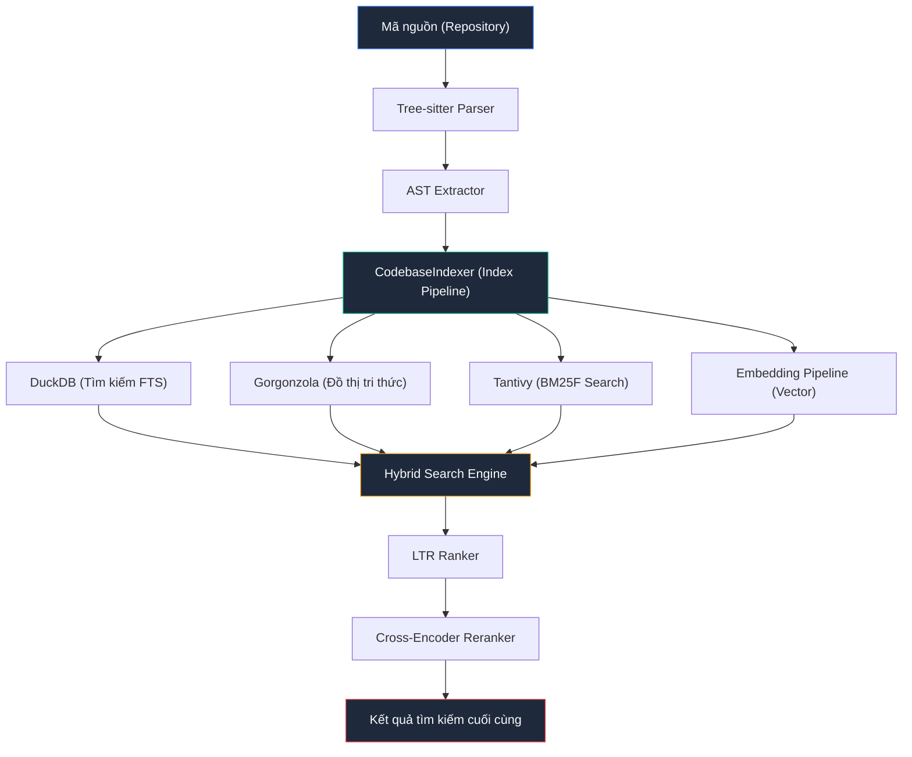
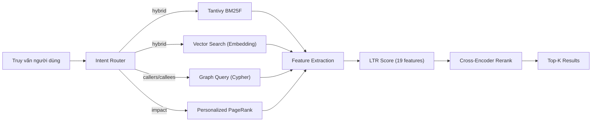

# Pecorino — Tài liệu Kỹ thuật Hệ thống

> Toàn bộ pipeline lập chỉ mục mã nguồn, cơ sở dữ liệu, và ngăn xếp ML/NLP

---

## 1. Tổng quan Kiến trúc

Pecorino là một **MCP Server** (Model Context Protocol) chuyên phân tích và lập chỉ mục mã nguồn. Hệ thống kết hợp nhiều lớp công nghệ:



---

## 2. Pipeline Lập chỉ mục Mã nguồn

### 2.1 Giai đoạn 1: Phân tích cú pháp (Parsing)

| Thành phần | Mô tả |
|---|---|
| [tree_sitter_parser.py](file:///media/lechibang/work/projects/pecorino/src/parsers/tree_sitter_parser.py) | Parser chính, sử dụng thư viện `tree-sitter` để tạo AST cho mã nguồn |
| [extractor.py](file:///media/lechibang/work/projects/pecorino/src/mcp_server/ast/extractor.py) | `TreeSitterExtractor` — trích xuất nodes (hàm, lớp, phương thức) và edges (CALLS, IMPORTS, INHERITS) từ cây AST |

**Ngôn ngữ được hỗ trợ** (mỗi ngôn ngữ có file `.scm` query riêng):

| Ngôn ngữ | Parser Tree-sitter | File Query |
|---|---|---|
| Python | `tree-sitter-python` | [python.scm](file:///media/lechibang/work/projects/pecorino/src/parsers/queries/python.scm) |
| Java | `tree-sitter-java` | [java.scm](file:///media/lechibang/work/projects/pecorino/src/parsers/queries/java.scm) |
| JavaScript | `tree-sitter-javascript` | [javascript.scm](file:///media/lechibang/work/projects/pecorino/src/parsers/queries/javascript.scm) |
| TypeScript | `tree-sitter-typescript` | [typescript.scm](file:///media/lechibang/work/projects/pecorino/src/parsers/queries/typescript.scm) |
| C/C++ | `tree-sitter-c`, `tree-sitter-cpp` | [cpp.scm](file:///media/lechibang/work/projects/pecorino/src/parsers/queries/cpp.scm) |
| Go | `tree-sitter-go` | [go.scm](file:///media/lechibang/work/projects/pecorino/src/parsers/queries/go.scm) |
| Rust | `tree-sitter-rust` | [rust.scm](file:///media/lechibang/work/projects/pecorino/src/parsers/queries/rust.scm) |
| Ruby | `tree-sitter-ruby` | [ruby.scm](file:///media/lechibang/work/projects/pecorino/src/parsers/queries/ruby.scm) |
| Swift | `tree-sitter-swift` | [swift.scm](file:///media/lechibang/work/projects/pecorino/src/parsers/queries/swift.scm) |
| Kotlin | `tree-sitter-kotlin` | — |
| C# | `tree-sitter-c-sharp` | — |
| Scala | `tree-sitter-java` (dùng chung) | — |

**Loại node được trích xuất:** `File`, `Class`, `Function`, `Method`, `Interface`, `Symbol`, `Module`, `ControlFlow`, `Lambda`, `Variable`, `Identifier`

**Loại edge (quan hệ) được trích xuất:**
- `CONTAINS` — File chứa Class/Function
- `CALLS` — Hàm gọi hàm khác
- `IMPORTS` — File import file khác
- `INHERITS` / `EXTENDS` / `IMPLEMENTS` — Kế thừa OOP
- `READS` / `WRITES` — Truy cập trạng thái (state access)
- `DATA_FLOWS_TO` — Luồng dữ liệu (taint analysis)
- `PARAMETER_OF` / `RETURNS` — Tham số và kiểu trả về
- `HAS_IDENTIFIER` — Liên kết node với identifier đã phân tích
- `CONTAINS_LAMBDA` — Lambda lồng nhau
- `TESTS` / `RAISES` / `HTTP_CALLS` — Các quan hệ đặc biệt

### 2.2 Giai đoạn 2: Phân giải phụ thuộc (Dependency Resolution)

[index_pipeline.py](file:///media/lechibang/work/projects/pecorino/src/mcp_server/index_pipeline.py) chứa hệ thống phân giải import theo từng ngôn ngữ:

| Ngôn ngữ | Chiến lược phân giải |
|---|---|
| **JS/TS** | Đường dẫn tương đối → `node_modules` → `package.json` (main/exports) → `index.{js,ts}` |
| **C/C++** | Thư mục cục bộ → repo root → `include/` → `src/include/` → tìm kiếm toàn bộ repo |
| **Python** | Đếm dấu chấm (relative import) → absolute module path → `__init__.py` |
| **Go** | `go.mod` module name → đường dẫn tương đối → tìm kiếm repo |
| **Rust** | Tách `::` → `.rs` file hoặc `mod.rs` / `lib.rs` / `main.rs` |

### 2.3 Giai đoạn 3: Lập chỉ mục và Lưu trữ

[CodebaseIndexer](file:///media/lechibang/work/projects/pecorino/src/mcp_server/index_pipeline.py#L56) thực hiện:

1. **Phân tích cú pháp song song** — sử dụng `ThreadPoolExecutor` với số worker = 75% CPU cores
2. **Lưu trữ batch** — chèn nodes vào DuckDB và Gorgonzola graph theo lô (chunk_size = 250)
3. **Tạo embedding vector** — song song với quá trình lập chỉ mục
4. **Xây dựng chỉ mục Tantivy** — BM25F tìm kiếm toàn văn
5. **Tính toán HCGS** — tóm tắt tĩnh từ dưới lên (bottom-up)
6. **Tính toán OOD features** — instability, coupling, depth
7. **Git features** — commit count, churn, authorship entropy, survival days

### 2.4 Ramdisk Optimization

[RamdiskIndex](file:///media/lechibang/work/projects/pecorino/src/mcp_server/ramdisk.py) — Xây dựng chỉ mục trong `/dev/shm` (tmpfs) để tránh write amplification trên SSD:
- Giới hạn mặc định: **60 MB**
- Sau khi hoàn thành, sao chép một lần duy nhất sang ổ SSD

---

## 3. Cơ sở dữ liệu

### 3.1 DuckDB — Tìm kiếm và Metadata

[index_db.py](file:///media/lechibang/work/projects/pecorino/src/mcp_server/index_db.py) quản lý lớp `CodeSearchIndex` với DuckDB.

**Bảng chính: `code_nodes`**

| Cột | Kiểu | Mô tả |
|---|---|---|
| `id` | VARCHAR (PK) | ID duy nhất: `file::kind::qname::line` |
| `name` | VARCHAR | Tên symbol |
| `kind` | VARCHAR | Loại: function, class, method |
| `filepath` | VARCHAR | Đường dẫn file |
| `start_line` / `end_line` | INTEGER | Vị trí trong file |
| `embedding` | FLOAT[384] | Vector embedding (all-MiniLM-L12-v2) |
| `pagerank` | DOUBLE | Điểm PageRank |
| `complexity` | INTEGER | Cyclomatic complexity |
| `in_degree` / `out_degree` | INTEGER | Bậc đồ thị |
| `hcgs_summary` | VARCHAR | Tóm tắt HCGS |
| `community_id` | INTEGER | ID cộng đồng Leiden |
| `git_commit_count` | INTEGER | Số commit |
| `git_days_since_change` | INTEGER | Ngày kể từ thay đổi cuối |
| `git_churn` | INTEGER | Lượng thay đổi tổng |
| `git_authors` | INTEGER | Số tác giả |
| `git_bug_fix_ratio` | DOUBLE | Tỷ lệ commit sửa lỗi |
| `git_survival_days` | INTEGER | Tuổi thọ file (ngày) |
| `git_ownership_entropy` | DOUBLE | Entropy sở hữu |
| `instability` | DOUBLE | Chỉ số bất ổn OOD |
| `coupling` | DOUBLE | Độ ghép nối |
| `depth` | INTEGER | Độ sâu trong đồ thị phụ thuộc |

**Bảng bộ nhớ đệm: `embeddings_cache`**

| Cột | Kiểu | Mô tả |
|---|---|---|
| `text_hash` | VARCHAR (PK) | SHA-256 hash của văn bản |
| `text` | VARCHAR | Văn bản gốc |
| `embedding` | DOUBLE[384] | Vector embedding |
| `model` | VARCHAR | Tên mô hình đã sử dụng |

### 3.2 Gorgonzola — Cơ sở dữ liệu Đồ thị

[gorgonzola_graph.py](file:///media/lechibang/work/projects/pecorino/src/mcp_server/gorgonzola_graph.py) sử dụng **Gorgonzola** (fork của Kùzu) — một cơ sở dữ liệu đồ thị thuộc tính (property graph database).

**Bảng Node:**

| Bảng | Cột chính | Mô tả |
|---|---|---|
| `CodeNode` | id, kind, name, qualified_name, file, line, end_line, complexity, docstring, embedding[384] | Node mã nguồn |
| `Identifier` | id, raw, tokens[], case_style, prefix, suffix, verb, entity, qualifier, canonical_verb, canonical_entity, domain, intent, embedding[384] | Phân tích định danh |
| `File` | id, name, path, extension, content_hash, mtime, lang | Metadata file |

**Bảng Quan hệ (21 loại):**
`HAS_IDENTIFIER`, `CONTAINS`, `CALLS`, `IMPORTS`, `INHERITS`, `PARAMETER_OF`, `RETURNS`, `DEPENDS_ON`, `DEFINES`, `EXTENDS`, `IMPLEMENTS`, `FILE_CHANGES_WITH`, `RAISES`, `TESTS`, `HTTP_CALLS`, `READS`, `WRITES`, `HAS_PARAMETER`, `USES`, `CONTAINS_LAMBDA`, `ACCESSES_STATE`, `RECURSES_TO`

### 3.3 Federated Graph

[federated_graph.py](file:///media/lechibang/work/projects/pecorino/src/mcp_server/federated_graph.py) — `FederatedGraphAPI` hợp nhất đồ thị từ nhiều repository đã đăng ký thành một instance Gorgonzola duy nhất, cho phép truy vấn call graph xuyên biên giới dự án.

---

## 4. Hệ thống Tìm kiếm

### 4.1 Tantivy BM25F

[tantivy_search.py](file:///media/lechibang/work/projects/pecorino/src/mcp_server/tantivy_search.py) — Engine tìm kiếm BM25F với **per-field boosting**:

| Trường | Boost mặc định | Mô tả |
|---|---|---|
| `name` | **5.0** | Tên symbol (ưu tiên cao nhất) |
| `kind` | **4.0** | Loại node (function, class, ...) |
| `summary` | **3.0** | Tóm tắt HCGS |
| `filepath` | **2.0** | Tên file |
| `body` | **1.0** | Mã nguồn |

Hiệu suất: **~5ms** cho 10.000 tài liệu. Mỗi field có **IDF độc lập**.

### 4.2 Intent Router

[intent_router.py](file:///media/lechibang/work/projects/pecorino/src/mcp_server/intent_router.py) — Phân loại heuristic dựa trên regex để định tuyến truy vấn:

| Mode | Ví dụ truy vấn |
|---|---|
| `callers` | "who calls OrderHandler?" |
| `callees` | "what does OrderHandler call?" |
| `impact` | "what depends on utils.py?" |
| `community` | "related to OrderHandler" |
| `intent` (dead_code) | "dead code" |
| `intent` (entry_points) | "entry points" |
| `cypher` | "MATCH (a)... RETURN..." |
| `hybrid` (mặc định) | Mọi truy vấn khác |

---

## 5. Ngăn xếp ML/NLP — Mô hình và Transformer

### 5.1 Bi-Encoder: Embedding Pipeline

**Hai hệ thống embedding song song:**

#### A. Sentence Transformer Embedder (cho DuckDB)

[embedder.py](file:///media/lechibang/work/projects/pecorino/src/mcp_server/embedder.py)

| Thuộc tính | Giá trị |
|---|---|
| **Mô hình** | `all-MiniLM-L12-v2` (sentence-transformers) |
| **Kiến trúc** | **12-layer MiniLM** (distilled từ BERT) |
| **Số chiều** | **384** |
| **Fallback** | `fastembed` (nếu torch không có) |
| **Max tokens** | ~512 tokens (~2048 ký tự) |
| **Batch size** | 128 |
| **Bộ nhớ đệm** | DuckDB `embeddings_cache` table (SHA-256 hash) |

```
Input text → Truncate (2048 chars) → SHA-256 hash → Cache lookup
                                                        ↓ miss
                     torch.set_num_threads(75% CPU) → SentenceTransformer.encode()
                                                        ↓
                                                   384-dim vector → Cache insert
```

#### B. ONNX Embedding Pipeline (cho tìm kiếm)

[embedding.py](file:///media/lechibang/work/projects/pecorino/src/mcp_server/embedding.py)

| Thuộc tính | Giá trị |
|---|---|
| **Mô hình mặc định** | `Xenova/all-MiniLM-L12-v2` (ONNX) |
| **Mô hình thay thế** | `nomic-ai/nomic-embed-text-v1.5` (quantized ONNX) |
| **Mô hình thay thế** | `bge-large` (1024-dim) |
| **Runtime** | **ONNX Runtime** (CPUExecutionProvider) |
| **Tokenizer** | HuggingFace `tokenizers` (Rust) |
| **Max tokens** | 512 (truncation tự động) |
| **Batch size** | 16 |
| **Thread-safe** | Lock (`_onnx_lock`) cho inference |
| **Pooling** | Mean pooling + L2 normalization |

```
Input texts → Tokenize (tokenizers) → Pad to max_len → ONNX Inference
                                                             ↓
                 Mean Pooling (attention mask) → L2 Normalize → Embedding vector
```

**Tiền tố Nomic:**
- Tìm kiếm: `"search_query: {query}"`
- Lập chỉ mục: `"search_document: {text}"`

### 5.2 Cross-Encoder: Reranker

[cross_encoder.py](file:///media/lechibang/work/projects/pecorino/src/mcp_server/cross_encoder.py)

| Thuộc tính | Giá trị |
|---|---|
| **Mô hình** | `cross-encoder/ms-marco-MiniLM-L-12-v2` |
| **Kiến trúc** | **12-layer MiniLM cross-encoder** (MS MARCO fine-tuned) |
| **Runtime** | **ONNX Runtime** (CPUExecutionProvider) |
| **Tokenizer** | HuggingFace `tokenizers` |
| **Max tokens** | 512 |
| **Đầu vào** | Cặp (query, document) |
| **Đầu ra** | Logit → Sigmoid → Điểm [0, 1] |
| **Top-N scored** | 30 ứng viên (cấu hình qua `PECORINO_CROSS_ENCODER_TOP_N`) |
| **Thread-safe** | Lock (`_ce_lock`) cho inference |

```
(query, candidate_text) → Tokenize as pair → Pad → ONNX Inference
                                                        ↓
                                               Logits → Sigmoid → Score [0,1]
```

**Reranking pipeline:**
1. Lấy top 30 ứng viên từ tìm kiếm hybrid
2. Tạo text: `"{name}\n{hcgs_summary}\n{body_text}"`
3. Chấm điểm cross-encoder cho mỗi cặp (query, text)
4. Sắp xếp lại theo `ce_score` giảm dần

### 5.3 Learning-to-Rank (LTR)

[ltr_ranker.py](file:///media/lechibang/work/projects/pecorino/src/mcp_server/ltr_ranker.py)

**Hệ thống xếp hạng thống nhất** kết hợp 19 đặc trưng từ nhiều nguồn:

#### Trọng số các đặc trưng (tổng = 1.0):

| Đặc trưng | Trọng số | Nguồn | Chuẩn hóa |
|---|---|---|---|
| `fts_score` | **0.26** | Tantivy BM25F | Clamp + scale /10 |
| `vector_sim` | **0.22** | Embedding cosine | Clamp [0,1] |
| `pagerank` | **0.08** | Gorgonzola graph | log1p(PR × 1000) |
| `ppr_score` | **0.06** | PPR (Personalized PageRank) | Clamp [0,1] |
| `in_degree` | **0.04** | Đồ thị | log1p / 5.0 |
| `betweenness` | **0.04** | Đồ thị | log1p(B × 10000) |
| `git_commit_count` | **0.04** | Git | log1p / 6.0 |
| `git_days_since_change` | **0.04** | Git | Exponential decay (half-life ~180 ngày) |
| `complexity` | **0.03** | AST | log1p / 4.0 |
| `prone_sim` | **0.02** | ProNE embedding | Clamp [0,1] |
| `out_degree` | **0.02** | Đồ thị | log1p / 5.0 |
| `git_churn` | **0.02** | Git | log1p / 10.0 |
| `git_ownership_entropy` | **0.02** | Git | / 3.0 |
| `git_bug_fix_ratio` | **0.02** | Git | Clamp [0,1] |
| `instability` | **0.02** | OOD | Clamp [0,1] |
| `coupling` | **0.02** | OOD | log1p / 5.0 |
| `depth` | **0.02** | Đồ thị | / 10.0 |
| `git_authors` | **0.01** | Git | log1p / 3.0 |
| `git_survival_days` | **0.01** | Git | / 730.0 |
| `inheritance_depth` | **0.01** | OOD | / 5.0 |

**Hai chế độ tính điểm:**
1. **XGBoost / Gradient Boosting** — nếu có mô hình đã huấn luyện (`model.predict()`)
2. **Tổ hợp tuyến tính có trọng số** — fallback mặc định

---

## 6. Thuật toán Đồ thị Nâng cao

### 6.1 Personalized PageRank (PPR)

[graph_algorithms.py](file:///media/lechibang/work/projects/pecorino/src/mcp_server/graph_algorithms.py#L125) — PPR trên đồ thị con 2-hop:

- **Alpha (teleport):** 0.15
- **Số vòng lặp:** 10 (power iteration)
- **Giới hạn:** Đồ thị con < 2000 nodes, hop 2 chỉ mở rộng 500 nodes

### 6.2 ProNE Structural Embeddings

[graph_algorithms.py](file:///media/lechibang/work/projects/pecorino/src/mcp_server/graph_algorithms.py#L200) — Embedding cấu trúc đồ thị 64 chiều (INT8):

1. **Bước 1:** Truncated SVD trên ma trận kề thưa (scipy)
2. **Bước 2:** Chebyshev spectral propagation (higher-order smoothing):
   - `emb = 0.5 × SVD + 0.3 × μ₁ + 0.2 × μ₂` (μ = normalized adjacency × embedding)
3. **Lượng tử hóa:** Float → INT8 (-128 to 127)

### 6.3 Leiden Community Detection

[graph_algorithms.py](file:///media/lechibang/work/projects/pecorino/src/mcp_server/graph_algorithms.py#L6) — Phát hiện cộng đồng với CPM quality:

- **Gamma sweep:** [0.05, 0.10, 0.15, 0.20, 0.30, 0.50, 0.80, 1.0, 1.5, 2.0, 3.0]
- **Chỉ số ổn định:** Adjusted Rand Index (ARI) giữa các phân vùng liên tiếp
- **Ngưỡng ổn định:** ARI > 0.99

### 6.4 HCGS — Hierarchical Code Graph Summarization

[hcgs.py](file:///media/lechibang/work/projects/pecorino/src/mcp_server/hcgs.py) — Tóm tắt mã nguồn phân cấp **không cần LLM**:

1. **Xây dựng levels:** Sắp xếp topo theo CALLS edges (leaf → root)
2. **Tóm tắt bottom-up:** Mỗi hàm nhận tóm tắt từ các hàm con nó gọi
3. **Phá vòng lặp:** Chọn node có ít callee chưa xử lý nhất

### 6.5 Naming Analyzer

[naming_analyzer.py](file:///media/lechibang/work/projects/pecorino/src/mcp_server/naming_analyzer.py) — Phân tích ngữ nghĩa định danh:

- **Tách tiền/hậu tố:** `m_`, `__`, `_t`, `_impl`
- **Nhận dạng case:** camelCase, PascalCase, snake_case, kebab-case, SCREAMING_SNAKE...
- **Tokenize:** `getUserById` → `["get", "user", "by", "id"]`
- **Phân tích ngữ pháp:** verb / entity / qualifier
- **Canonical verb:** `get`, `fetch`, `load` → `"retrieve"`
- **Suy luận intent:** retrieve → `"query"`, create/update/delete → `"mutation"`, validate → `"validation"`
- **Suy luận domain:** `/auth/` → `"auth"`, `/payment/` → `"payment"`

---

## 7. Pipeline Tìm kiếm End-to-End



1. **Intent Router** phân loại truy vấn → chọn chế độ tìm kiếm
2. **Tantivy BM25F** trả về điểm FTS per-field
3. **Embedding cosine similarity** cho tìm kiếm ngữ nghĩa
4. **Graph algorithms** (PPR, ProNE) tính điểm cấu trúc
5. **LTR Ranker** kết hợp 19 đặc trưng thành điểm xếp hạng thống nhất
6. **Cross-Encoder** re-rank top 30 ứng viên để cho kết quả cuối cùng

---

## 8. Tóm tắt các Mô hình ML/NLP

| # | Mô hình | Vai trò | Kiến trúc | Dim | Runtime |
|---|---|---|---|---|---|
| 1 | `all-MiniLM-L12-v2` | Bi-Encoder Embedding (DuckDB cache) | 12-layer MiniLM (distilled BERT) | 384 | PyTorch / fastembed |
| 2 | `Xenova/all-MiniLM-L12-v2` | Bi-Encoder Embedding (tìm kiếm ONNX) | 12-layer MiniLM ONNX | 384 | ONNX Runtime |
| 3 | `nomic-ai/nomic-embed-text-v1.5` | Bi-Encoder Embedding (thay thế) | Nomic Embed v1.5 (quantized) | 768 | ONNX Runtime |
| 4 | `bge-large` | Bi-Encoder Embedding (thay thế) | BGE-Large | 1024 | ONNX Runtime |
| 5 | `cross-encoder/ms-marco-MiniLM-L-12-v2` | Cross-Encoder Reranker | 12-layer MiniLM (MS MARCO tuned) | — | ONNX Runtime |
| 6 | XGBoost / Gradient Boosting | LTR Scorer | Ensemble decision trees | — | scikit-learn / xgboost |
| 7 | ProNE | Structural Graph Embedding | SVD + Chebyshev spectral | 64 (INT8) | NumPy + SciPy |
| 8 | Leiden (CPM) | Community Detection | Louvain-variant graph clustering | — | Gorgonzola native |
| 9 | PPR (Power Iteration) | Graph Reranking | Personalized PageRank | — | Pure Python |

