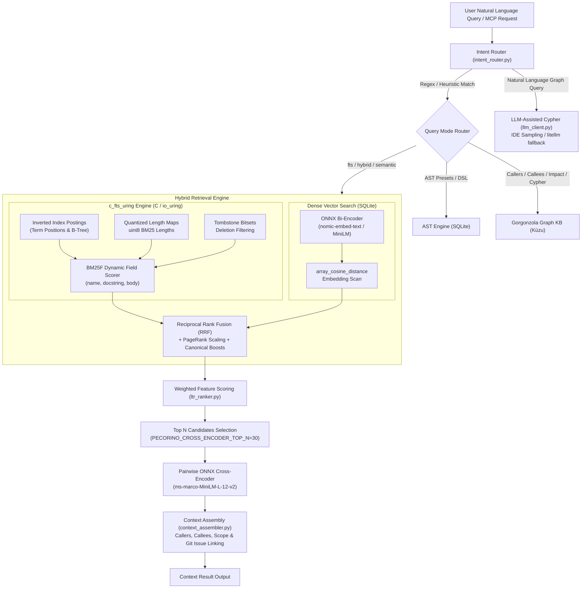
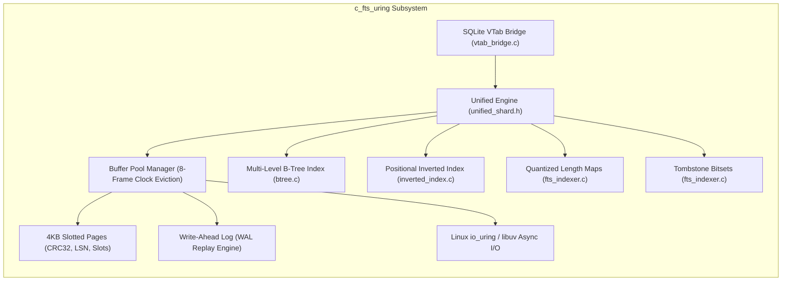

# Search & Ranking Architecture

This document describes Pecorino's search pipeline, covering keyword search via `c_fts_uring`, vector similarity via SQLite-stored embeddings, graph queries, and result scoring.

The legacy Tantivy search engine has been completely decommissioned and replaced by **`c_fts_uring`**—a custom, native C-based storage and Full-Text Search (FTS) engine utilizing asynchronous I/O (`io_uring`/`libuv`), slotted pages, Write-Ahead Logging (WAL), and direct SQLite virtual table integration.

---

## 1. High-Level Architecture Overview

The search subsystem executes queries across multiple ranking methods—lexical, semantic, structural, and git-based—then assembles enriched context for LLM agents:



---

## 2. Storage & Full-Text Engine: `c_fts_uring`

The core FTS and tabular indexing subsystem is implemented in C under [`modules/c_fts_uring`](file:///run/media/lechibang/work/projects/pecorino/modules/c_fts_uring) and bound via [`fts_uring_bindings.py`](file:///run/media/lechibang/work/projects/pecorino/src/mcp_server/fts_uring_bindings.py) and [`index_db.py`](file:///run/media/lechibang/work/projects/pecorino/src/mcp_server/index_db.py). It replaces external search daemons with an embedded, crash-resilient storage engine.



### 2.1. 4KB Slotted Pages & Record Layout
- **Page Header**: Every 4096-byte page begins with a standard 24-byte [`PageHeader`](file:///run/media/lechibang/work/projects/pecorino/modules/c_fts_uring/include/slotted_page.h):
  - `lsn` (uint64_t): Log Sequence Number for WAL recovery verification.
  - `page_id` (uint32_t): Unique physical page identifier.
  - `checksum` (uint32_t): CRC32 content validation preventing silent corruption.
  - `page_type` (uint16_t): Enum identifying `PAGE_TYPE_ROW`, `PAGE_TYPE_FTS_POSTING`, `PAGE_TYPE_LENGTH_MAP`, `PAGE_TYPE_BTREE_LEAF`, `PAGE_TYPE_BTREE_INTERNAL`, or `PAGE_TYPE_TOMBSTONE_BITSET`.
  - `free_space_lower` & `free_space_upper` (uint16_t): Dual-pointer boundaries for slot arrays (growing upward) and tuple payload bytes (growing downward).
  - `slot_count` (uint16_t): Total number of tuple slots allocated.
- **Dynamic Defragmentation**: In-page tuple compaction runs automatically on slot deletion, preserving continuous free space.

### 2.2. Buffer Pool Manager & Clock Eviction
- **Frame Management**: The [`BufferPoolManager`](file:///run/media/lechibang/work/projects/pecorino/modules/c_fts_uring/include/buffer_pool.h) manages dynamic memory frames with pin counts, dirty bits, and page LSN tracking.
- **8-Frame Clock Eviction**: Replaces expensive LRU locks with a lock-free circular clock hand sweep.
- **Sequential Scan Hints**: When executing sequential table scans, frames are tagged with `HINT_SEQUENTIAL_SCAN`, applying Most Recently Used (MRU) eviction to prevent cache thrashing.

### 2.3. Write-Ahead Logging (WAL) & Crash Recovery
- **Micro-Transactions**: All mutations (`WAL_REC_INSERT`, `WAL_REC_UPDATE`, `WAL_BTREE_SPLIT`, `WAL_FTS_TOMBSTONE`, `WAL_FTS_DELTA_INSERT`) are sequentially appended to `.wal` files via [`wal_append_record`](file:///run/media/lechibang/work/projects/pecorino/modules/c_fts_uring/include/wal.h) before dirty frames flush to `.dat` files.
- **Crash Recovery Replay**: On startup, [`wal_replay_recovery`](file:///run/media/lechibang/work/projects/pecorino/modules/c_fts_uring/include/wal.h) reads log records sequentially and reapplies uncommitted or unpersisted micro-transactions.

### 2.4. POSIX Shared Memory (SHM)
- **Zero-Copy IPC**: Shared memory allocations (`shm_open`, `mmap`) expose buffer pool memory regions across process boundaries, allowing multi-worker indexing and query execution without serializing page buffers.

### 2.5. Primary Key Multi-Level B-Tree Indexing
- Maps primary keys (e.g. 16-byte MD5 UUIDs) to physical `(page_id, slot_id)` locations via [`btree.c`](file:///run/media/lechibang/work/projects/pecorino/modules/c_fts_uring/src/btree.c).
- Handles leaf node overflow with automatic splitting and transactional WAL integration (`WAL_BTREE_SPLIT`).

### 2.6. Quantized Length Maps & Tombstone Bitsets
- **Logarithmic Length Quantization**: BM25 document length normalization uses pre-quantized uint8 values instead of parsing tuple data at query time. uint32 field lengths `[0 … 65535]` are quantized into 1-byte uint8 values `[0 … 255]`:
  $$\text{quantized\_len} = \min\left(255, \; \text{round}\left(16 \cdot \ln(1 + \text{length})\right)\right)$$
  Stored in dedicated `PAGE_TYPE_LENGTH_MAP` pages (1024 documents per page across 4 fields).
- **Tombstone Bitsets**: Deleted document tracking uses dense bitsets stored in `PAGE_TYPE_TOMBSTONE_BITSET` pages (32,768 documents per page), providing fast deletion filtering during scoring.

### 2.7. Positional Indexing, Phrase Search & Dynamic BM25F
- **Inverted Postings**: Postings map `term_id -> (doc_id, page_id, slot_id, pos_count, positions[8])` across chained `InvertedIndexPage` blocks.
- **Phrase & Proximity Matching**: Supports exact phrase matches (`"foo bar"`) and proximity constraints (`NEAR/10`) via [`shard_search_phrase_indexed`](file:///run/media/lechibang/work/projects/pecorino/modules/c_fts_uring/include/inverted_index.h).
- **Dynamic Field Weights**: Per-field weights for `name`, `kind`, `docstring`, and `body` are passed dynamically at query time (`query.field_weights[4]`).

### 2.8. SQLite Virtual Table Integration (`vtab_bridge.c`)
- Exposes `c_fts_uring` as a native SQLite virtual table module `fts_uring`:
  ```sql
  CREATE VIRTUAL TABLE pecorino_ast USING fts_uring('/path/to/repo_fts', 6144);
  ```
- Handles `xBestIndex` and `xFilter` to execute high-speed indexed scans directly inside SQLite queries:
  ```sql
  SELECT c.id, c.name, c.kind, c.filepath, a.bm25f_score AS bm25_score,
         ((a.rrf_score) * (1.0 + COALESCE(c.pagerank, 0.0))) AS score
  FROM pecorino_ast a
  JOIN code_nodes c ON lower(hex(c.uuid)) = a.node_id
  WHERE a.query MATCH 'rebuild_fts'
  ORDER BY score DESC LIMIT 10;
  ```

---

## 3. Search & Reranking Pipeline

### 3.1. Intent Router & LLM-Assisted Cypher Generation
Natural language queries are classified by [`IntentRouter`](file:///run/media/lechibang/work/projects/pecorino/src/mcp_server/intent_router.py) into dedicated search modes:
- **Callers / Callees**: `who calls X?` → `callers`, `what does X call?` → `callees`.
- **Impact Tracing**: `impact of X` / `what depends on X?` → `impact`.
- **AST Intents**: `dead code` → `intent:dead_code`, `entry points` → `intent:entry_points`, `all classes` → `intent:all_classes`.
- **Cypher Pass-through & Generation**: If the query is natural language targeting graph relationships, [`generate_cypher`](file:///run/media/lechibang/work/projects/pecorino/src/mcp_server/llm_client.py) sends a prompt to an LLM and parses the returned Cypher query. It uses IDE sampling (MCP protocol sampling) first, falling back to `litellm` (`PECORINO_LLM_MODEL`).

### 3.2. Bi-Encoder Embeddings (`embedding.py` & `embedder.py`)
Code entities and docstrings are converted to dense vector embeddings using local ONNX Bi-Encoders (`all-MiniLM-L12-v2` or `nomic-embed-text-v1.5.onnx`). Embeddings are stored in SQLite's `code_nodes.embedding` columns, allowing cosine distance calculations.

### 3.3. Bottom-Up Call Graph Summaries (`hcgs.py`)
Implemented in [`hcgs.py`](file:///run/media/lechibang/work/projects/pecorino/src/mcp_server/hcgs.py), this module generates summaries without calling an LLM:
1. **Topological Sort**: `build_levels(graph)` queries `[:CALLS]` edges and performs a topological sort, partitioning functions into dependency levels (Level 0 = leaves with no callees, Level 1+ = their callers).
2. **Summary Concatenation**: `process_levels_static()` walks from leaves upward, concatenating each function's callee names and docstrings into a summary string for the caller.
3. **Indexing**: Generated summaries are indexed in `c_fts_uring`, re-embedded by the Bi-Encoder, and available for Cross-Encoder scoring.

### 3.4. Hybrid Retrieval & Reciprocal Rank Fusion (RRF)
During `hybrid` search mode, lexical results from `c_fts_uring` and vector results from SQLite are combined using Reciprocal Rank Fusion:
$$\text{RRF\_Score}(d) = \sum_{m \in \{\text{FTS}, \text{Vector}\}} \frac{1}{60 + \text{Rank}_m(d)}$$
The composite score is further weighted by global PageRank centrality and canonical verb/entity boosts:
$$\text{Final\_Score}(d) = \text{RRF\_Score}(d) \times (1.0 + \text{PageRank}(d)) + \text{CanonicalBoost}(d)$$

### 3.5. Weighted Feature Scoring (`ltr_ranker.py`)
[`ltr_ranker.py`](file:///run/media/lechibang/work/projects/pecorino/src/mcp_server/ltr_ranker.py) computes a final score for each candidate as a weighted linear sum: `score = sum(weight[i] * feature[i])`. The weights are hardcoded in a Python dictionary—there is no trained ML model or gradient descent involved.

The ranker extracts these features for each candidate:

| Category | Feature Name | Description |
| :--- | :--- | :--- |
| **Retrieval** | `fts_score`, `vector_sim` | Normalized BM25 and cosine similarity scores (0–1) |
| **Graph Centrality** | `pagerank`, `betweenness`, `ppr_score`, `prone_sim` | PageRank, Betweenness Centrality, Personalized PageRank, ProNE structural embedding similarity |
| **Topology & Degree** | `in_degree`, `out_degree`, `depth`, `inheritance_depth` | `log(1 + d)` normalized dependency and hierarchy depths |
| **Code Quality** | `instability`, `coupling`, `complexity` | Martin's instability metric `Ce / (Ca + Ce)`, afferent/efferent coupling, cyclomatic complexity |
| **Git Evolution** | `git_commit_count`, `git_days_since_change`, `git_churn`, `git_ownership_entropy`, `git_bug_fix_ratio`, `git_authors`, `git_survival_days` | Historical volatility, Shannon entropy on per-author commit counts, bug-fix frequency, and code churn |

### 3.6. Pairwise ONNX Cross-Encoder Reranker (`cross_encoder.py`)
The top N candidates (configured by `PECORINO_CROSS_ENCODER_TOP_N=30`) are selected from the weighted scoring / RRF candidate set. An ONNX runtime pipeline runs [`ms-marco-MiniLM-L-12-v2`](file:///run/media/lechibang/work/projects/pecorino/src/mcp_server/cross_encoder.py) inference on query-candidate pairs `(query, f"{name} {summary} {body}")`. Candidates are reranked by their logit scores, pushing contextually relevant symbols to the top.

### 3.7. Context Assembly & Enrichment (`context_assembler.py`)
Top search results are assembled into complete context bundles via [`assemble_context`](file:///run/media/lechibang/work/projects/pecorino/src/mcp_server/context_assembler.py):
- **Structural Context**: Direct callers, callees, and parent scope (classes/modules) queried from Gorgonzola.
- **Temporal Context**: Parses recent `git log` entries and extracts linked PR/issue references (`#123`, `GH-456`, `PROJ-12`).

---

## 4. Configuration & Environment Variables

Key parameters governing the search and reranking subsystems in [`src/mcp_server/config.py`](file:///run/media/lechibang/work/projects/pecorino/src/mcp_server/config.py):

| Variable | Default | Description |
| :--- | :--- | :--- |
| `PECORINO_ENABLE_EMBEDDINGS` | `true` | Enables Bi-Encoder dense vector generation and vector search. |
| `PECORINO_EMBEDDING_MODEL` | `models/Xenova/all-MiniLM-L12-v2` | Model path or HuggingFace repo for vector embeddings (`nomic-embed-text-v1.5`, etc.). |
| `PECORINO_EMBEDDING_DIM` | `384` | Dimensionality of embeddings (`384`, `768`, or `1024`). |
| `PECORINO_ENABLE_CROSS_ENCODER` | `true` | Enables ONNX Cross-Encoder pairwise reranking. |
| `PECORINO_CROSS_ENCODER_MODEL_REPO` | `cross-encoder/ms-marco-MiniLM-L-12-v2` | HuggingFace repository or local path for the ONNX Cross-Encoder. |
| `PECORINO_CROSS_ENCODER_TOP_N` | `30` | Number of top candidates passed to the Cross-Encoder. |
| `PECORINO_ENABLE_HCGS` | `true` | Enables bottom-up call graph summary generation. |
| `PECORINO_LLM_MODEL` | `ollama/llama3` | Fallback model used by `litellm` for natural language to Cypher generation when IDE sampling is unavailable. |
